# UART Deep Dive: How Two Devices Talk Over a Simple Serial Connection

### From bits and baud rate to sampling, parity, FIFO, interrupts, DMA and ESP32 — a complete story-driven engineering journey

Your ESP32 is sitting on your desk.

A sensor wants to send it a number. A GPS module wants to send coordinates. A computer wants to send commands. A debug console wants to print logs.

Somehow, all of those tiny electrical signals become meaningful characters on your screen.

But here's the strange part: the wire itself doesn't know what a character is. It doesn't know what a number is. It doesn't even know what a "1" or a "0" is, not really. It only knows one thing — a voltage is either high, or it's low.

So how does a pattern like

```
01001000
```

become the letter

```
H
```

on your terminal? And here's an even harder question: how does the receiver know where that first `0` even *starts*? There's no announcement. No handshake. No little flag that pops up saying "message incoming." Just a wire, silently switching between two voltage levels.

That gap — between "a wire that only knows high and low" and "a receiver that reliably reconstructs your data" — is the real UART problem. Everything in this article exists to close that gap, piece by piece.

By the end, you won't just know *what* UART is. You'll understand *why* every piece of it exists — the start bit, the sampling point, the parity bit, the FIFO, the interrupt, the DMA controller — because each one is the answer to a very specific engineering question. And you'll be able to mentally trace one single bit through its entire journey:

```
TX pin → wire → RX pin → input logic → start detection → timing →
sampling → shift register → parity check → stop check → FIFO →
DMA → RAM → driver → ring buffer → protocol parser → application
```

Let's start with a story.

---

## 1. Two Warehouses and One Narrow Road

Imagine two small warehouses on opposite sides of a town.

**Warehouse A** wants to send boxes of goods to **Warehouse B**. There's only one road connecting them, and it's narrow — only one vehicle can be on it at a time, moving in one direction.

There's no phone line between the warehouses. No radio. Nothing except that one road. Warehouse B has a problem. It needs to know:

- *When* does a delivery start?
- *How fast* is the vehicle moving, so it knows when to expect the next box?
- *How many* boxes belong to this delivery?
- *How does it know* if a box got damaged along the way?
- *When* is the delivery actually finished?

None of these questions can be answered just by staring at the road. The road doesn't carry information about deliveries — it just carries vehicles. Warehouse A and Warehouse B need to agree, ahead of time, on a set of *rules* that turn "a vehicle drove past" into "a box of goods arrived, and here's what was in it."

This is exactly the problem UART solves — except the "road" is a wire, the "vehicle" is an electrical signal, and the "boxes" are bits. We'll keep coming back to this story. Every time we introduce something new, we'll ask: *what's the warehouse equivalent?* Here's the map we'll build on:

| Warehouse concept | UART concept |
|---|---|
| Warehouse A | Transmitter (TX) |
| Warehouse B | Receiver (RX) |
| The road | The wire |
| A box | A bit |
| Delivery speed | Baud rate |
| "A delivery is starting" signal | Start bit |
| Box contents | Data bits |
| A quick check to catch mistakes | Parity bit |
| "Delivery finished" marker | Stop bit |
| Receiving shelf | FIFO |
| A worker who moves boxes without bothering the manager | DMA |
| The manager | CPU |
| The storage room | RAM |
| Delivery paperwork describing what boxes *mean* | Application protocol |

Keep this table in mind. We're going to build UART one warehouse problem at a time.

---

## 2. A Wire Doesn't Know What a Letter Is

Before we say the word "UART," sit with one uncomfortable truth: **a wire carries voltage. That's it.**

It doesn't carry letters, numbers, or "temperature is 24.5°C." It carries a physical electrical state — high or low — and nothing more. Everything else has to be *reconstructed* by the receiver, based on rules both sides agreed on in advance.

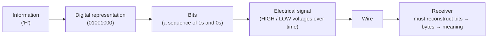

**The wire is dumb. The intelligence lives entirely in the agreement between sender and receiver.** UART *is* that agreement.

---

## 3. Why Not Just Use More Wires? Parallel vs. Serial

An obvious idea: to send a full byte (8 bits), why not use 8 wires — one per bit — and send them all at once?

```text
PARALLEL COMMUNICATION

D7 ─────────────►
D6 ─────────────►
D5 ─────────────►
D4 ─────────────►
D3 ─────────────►
D2 ─────────────►
D1 ─────────────►
D0 ─────────────►
   (all 8 bits arrive at the exact same instant)
```

Think of it as an 8-lane highway — every lane carries one bit, and they all arrive together. This is **parallel communication**, and it really was used in older systems like early printer ports. But highways are expensive:

| Problem | Why it matters |
|---|---|
| **Pin count** | 8 bits need 8 wires; a 32-bit value needs 32 wires. MCU pins are scarce and expensive. |
| **Skew** | Tiny differences in wire length/capacitance cause bits to arrive at slightly different times — at high speed, this corrupts data. |
| **Cost & complexity** | More wires means thicker cables, more connector pins, more PCB routing. |

**Serial communication** takes the opposite approach: one wire, and bits travel one after another.

```text
SERIAL COMMUNICATION

D0 → D1 → D2 → D3 → D4 → D5 → D6 → D7
(one lane, bits separated in TIME instead of SPACE)
```

Fewer wires, no skew problem, simpler connectors — sometimes just TX, RX, and GND. The tradeoff: now that there's no longer 8 separate wires to keep bits apart, *timing* becomes everything.

> **The real question this creates:** if there's only one wire and bits arrive one after another, how does the receiver know when one bit ends and the next begins? This single question is the reason UART's entire internal design exists the way it does. Every section from here forward is, in some way, answering it.

---

## 4. What UART Actually Stands For

**UART = Universal Asynchronous Receiver / Transmitter.**

| Word | Meaning |
|---|---|
| **Universal** | General-purpose — configurable baud rate, data bits, parity, stop bits; not tied to one vendor or format |
| **Asynchronous** | No shared clock wire between sender and receiver |
| **Receiver / Transmitter** | It can both receive and send — in practice, two largely independent mechanisms bundled into one peripheral |

### Why "Asynchronous" Is the Whole Point

Some serial protocols (like SPI) use a **shared clock wire** — one side sends a ticking clock signal, and the other reads a bit every tick.

```text
Synchronous (SPI-style):

SCLK ──┐  ┌──┐  ┌──┐  ┌──►
       └──┘  └──┘  └──┘
DATA ──────────────────────►
```

UART doesn't do that — there's no dedicated clock wire:

```text
Asynchronous (UART-style):

TX ─────────────────────► RX
      (no shared clock wire)
```

This doesn't mean UART has no clock at all. **Both sides have their own internal clock**, ticking independently. They simply don't share one clock signal over a wire. Instead:

1. Both sides **agree in advance**, in software, on a communication speed (baud rate) and frame format (data bits, parity, stop bits).
2. Each side has its own **independent local clock**, configured to run at approximately the agreed rate.
3. At the start of every byte, a **start bit** tells the receiver: *"A new frame is beginning right now — align your timing to this exact moment."*
4. From that reference point, the receiver uses its own clock plus the known baud rate to predict *when* each subsequent bit will arrive, and reads (samples) the line at those predicted moments.

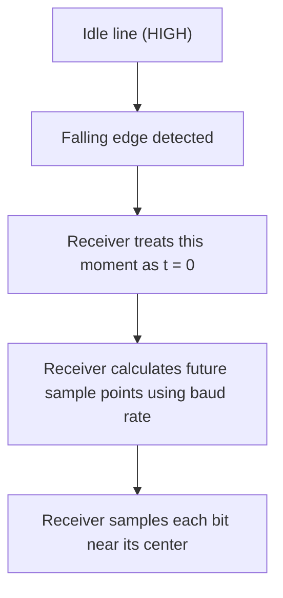

> **Key mental model:** UART doesn't share a clock — it shares an *agreement about timing*, and re-synchronizes that agreement at the start of every single frame using the start bit. This is the entire trick that makes asynchronous communication work.

---

## 5. TX and RX: Who Talks, Who Listens

```text
Device A                          Device B

TX  ───────────────────────────►  RX
RX  ◄───────────────────────────  TX
GND ─────────────────────────────  GND
```

- **TX (Transmit)** — the pin a device uses to *send* data.
- **RX (Receive)** — the pin a device uses to *listen*.
- **GND (Ground)** — a shared electrical reference. Without a common ground, "high" and "low" don't mean the same thing on both sides.

TX on one device always connects to RX on the other, and vice versa — TX is a mouth, RX is an ear.

```text
✅ CORRECT:                      ❌ WRONG (classic mistake):
A TX ────────► B RX              A TX ────────► B TX
A RX ◄──────── B TX              A RX ◄──────── B RX
```

If you wire TX-to-TX, both sides are "speaking" into wires nothing is listening on, and both are "listening" on wires nothing is speaking into. No data gets through — and on some hardware, two outputs actively driving the same wire can cause electrical contention. Always cross TX and RX, unless a board's pin labeling has already been crossed for you internally (check the documentation).

---

## 6. UART Is Not RS-232 (Please Don't Mix These Up)

This is one of the most common — and consequential — points of confusion in the field.

**UART** describes a *framing and timing discipline* — how bits are organized into start bits, data bits, parity, and stop bits, and how timing is used to interpret them. It says nothing about voltage levels.

**RS-232** is an *electrical standard* — actual voltage levels, connector shapes, and signal names, older than most microcontrollers you'll ever touch.

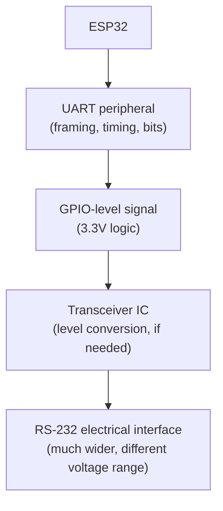

| Property | ESP32 UART (logic-level) | RS-232 |
|---|---|---|
| Voltage domain | 3.3V logic | Much wider voltage swing (positive and negative ranges) |
| Safe to connect directly to MCU GPIO? | Yes | **No — can damage the pin** |
| Needs a transceiver IC? | No | Yes (e.g., a MAX3232-type level-shifting chip) |
| Typical use today | MCU-to-MCU, MCU-to-sensor | Legacy industrial/PC equipment |

**Directly wiring a real RS-232 port to an ESP32 GPIO pin can permanently damage the GPIO.** If you need to talk to genuine RS-232 equipment, a level-shifting transceiver has to sit in between.

> **Mental separation to keep forever:** UART is a *framing/protocol* layer. RS-232 is one possible *electrical* dialect that framing can be carried over, at different voltages. They are related, but they are not the same layer.

---

## 7. The Wire Only Shows High and Low

Strip everything away, and here's what the receiver actually observes on the RX pin, moment to moment:

```text
HIGH  HIGH  LOW  HIGH  HIGH  LOW  LOW  ...
```

No punctuation, no built-in "start of message" flag — just a long, undifferentiated stream of voltage states. For this to become meaningful, the receiver needs three things it doesn't get for free:

1. **Timing** — when does one bit end and the next begin?
2. **Framing** — where does a group of bits (a byte) start and stop?
3. **Encoding** — what do these particular high/low patterns represent?

This is exactly the problem our warehouses faced. Watching the road tells Warehouse B nothing about *when* a delivery starts. They need rules. That's what we build next.

---

## 8. The Idle State: An Empty Road

Before any data is sent, the line has to sit in a default, resting state — otherwise the receiver could never tell "nothing is happening" from "someone's about to send a 0."

By convention, **idle is HIGH**.

```text
HIGH ─────────────────────────────────────
       (line is idle — nothing being sent)
```

Back at the warehouse: the road is simply empty. Warehouse B knows this is the "resting" condition, and it's specifically watching for a *change* from this state.

---

## 9. The Start Bit: The "Aha" Moment

The receiver is quietly watching an idle, HIGH line. Then, suddenly:

```text
HIGH
────────┐
         │
         └──────── LOW
```

That single HIGH-to-LOW transition — the **start bit** — is the signal the receiver has been waiting for: *"A frame is starting right now."*

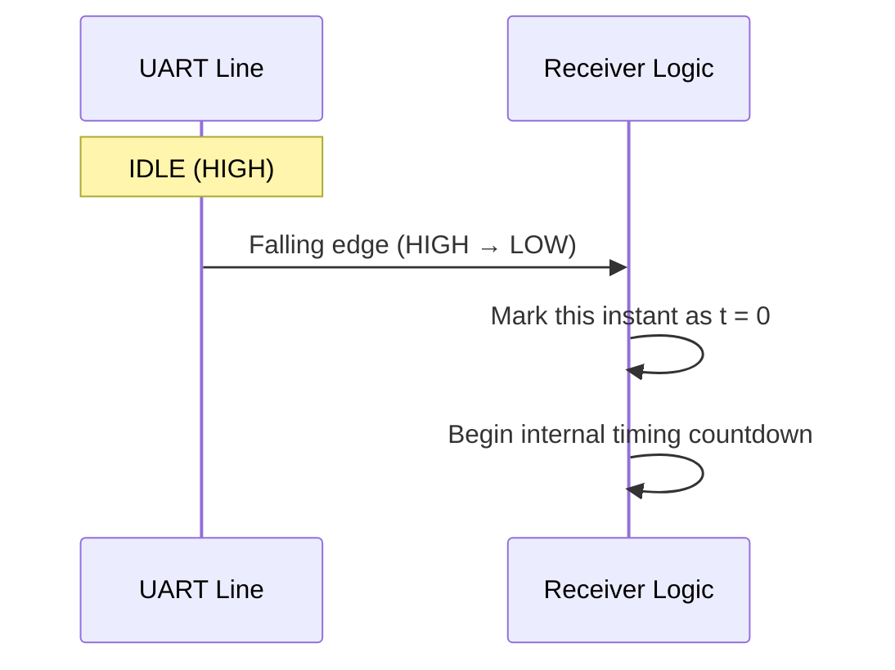

**Why does it need to exist?** Remember — UART has no shared clock wire. Without *something* to say "begin counting time from this exact instant," the receiver would have no reference point at all; it couldn't tell whether a given falling edge was the start of byte #1 or somewhere mid-way through byte #47. The start bit solves exactly one problem: it gives the receiver a **shared moment in time** to anchor its timing to.

Back at the warehouse: this is the signal flag at the start of the road going up. "A delivery is beginning — right now. Start your clock."

---

## 10. Building the UART Frame, Piece by Piece

```text
IDLE

IDLE | START

IDLE | START | DATA

IDLE | START | DATA | PARITY

IDLE | START | DATA | PARITY | STOP | IDLE
```

| Field | Purpose |
|---|---|
| **IDLE** | Line at rest, HIGH — nothing happening |
| **START** | LOW — "a new byte begins now" |
| **D0–D7** | The data bits (8-bit is most common; 5/6/7/9-bit also exist) |
| **PARITY** *(optional)* | A lightweight error-detection bit |
| **STOP** | End of frame; line returns to idle HIGH |
| **IDLE** | Resting again, waiting for the next byte |

Every UART transmission — a temperature reading, a GPS coordinate, a single keystroke — is packaged exactly this way. Let's look closer at each piece.

---

## 11. Data Bits: Why Order Matters (LSB First)

Take a concrete byte: **0xB2**.

```text
Byte (binary):  1  0  1  1  0  0  1  0
Label:         D7 D6 D5 D4 D3 D2 D1 D0
```

Here's the detail that trips up almost everyone at first: **UART transmits the least significant bit (D0) first.**

```text
Numeric representation (how we write it):
D7  D6  D5  D4  D3  D2  D1  D0
 1   0   1   1   0   0   1   0

Wire transmission order (LSB-first):
D0 → D1 → D2 → D3 → D4 → D5 → D6 → D7
 0 →  1 →  0 →  0 →  1 →  1 →  0 →  1
```

The value never changes — only the order in which bits travel on the wire changes. If you're ever decoding a raw signal on a logic analyzer manually, reading bits in the wrong order gives you a completely different (wrong) byte. The receiver knows to expect D0 first because it was configured that way in advance, and it places each incoming bit into the correct position as it reconstructs the byte.

---

## 12. Baud Rate: The Timing Agreement

Since there's no shared clock wire, both sides agree in advance on exactly how long each bit lasts — the **baud rate**, roughly "bits per second." Common values: **9600** and **115200**.

```text
bit_time = 1 / baud_rate
```

At 9600 baud: `1 / 9600 ≈ 104.17 µs` per bit.
At 115200 baud: `1 / 115200 ≈ 8.68 µs` per bit.

```text
Timeline at 9600 baud:
|◄──── 104.17 µs ────►|◄──── 104.17 µs ────►|◄──── 104.17 µs ────►|
          D0                    D1                    D2

Timeline at 115200 baud:
|◄─ 8.68 µs ─►|◄─ 8.68 µs ─►|◄─ 8.68 µs ─►|
      D0             D1             D2
```

Back to the warehouse: this is the two warehouses agreeing, "every box gets exactly one fixed-length time slot on the road." Nobody announces when a box passes a specific point — you're expected to know, based on the agreed speed, when to look.

**Real-world analogy — the conveyor belt:** picture an inspector watching boxes go by on a belt. The faster the belt moves, the less time the inspector has to look at each box before it's gone. A faster baud rate means less time margin per bit — which makes accurate timing more critical.

If the two sides don't agree on this speed, the whole system falls apart — this is exactly what happens when you set the wrong baud rate on a serial terminal and get a screen full of garbled characters.

---

## 13. The Big Question: When Does the Receiver Actually Read a Bit?

The signal stays at some voltage — high or low — for an entire bit period. So at exactly what moment does the receiver decide, "this bit is a 1" or "this bit is a 0"?

That decision moment is **sampling** — arguably the single most important concept in this whole article.

**Sampling means looking at the signal at one specific instant in time, and recording whether it's HIGH or LOW at that instant.**

```text
Signal:
────────────────┐         ┌──────────────
                 │         │
                 └─────────┘

Sample (● marks the instant the receiver checks):
────────────────┐  ●      ┌──────────────
                 │         │
                 └─────────┘
```

Crucial to get right: **the receiver is not continuously converting the signal into fresh data at every instant.** It uses its internal timing (anchored by the start bit) to identify *specific instants* worth checking, and makes a bit decision only at those instants.

### ⚠️ A very common misconception

❌ **Wrong idea:** "Sampling means reading half the bits" or "don't sample between D0 and D1."

✅ **Correct model:** sampling happens *inside* each bit's window — never at the boundary between two bits — and ideally as close to the **center** of that window as possible.

---

## 14. Where Exactly Should the Receiver Sample?

```text
One bit period:
|-----------------------------|

Bad — sampling right at the edge:
|-------------------------X---|
                            ↑ too close to the boundary

Better — sampling in the middle:
|--------------●---------------|
               ↑ center of the bit
```

Sampling near the *center* gives the maximum possible timing margin on both sides. If your clock runs slightly fast or slow (and it always does, at least a little), a center sample still lands safely inside the correct bit — an edge sample could easily land in the wrong one entirely.

A simple analogy: if a train is scheduled to arrive sometime within a 10-minute window, checking the platform at minute 5 gives you the most safety margin against the train being a bit early or late. Checking at minute 9.9 leaves almost no room for error.

### A concrete timing walkthrough (9600 baud, bit_time ≈ 104.17 µs)

```text
Start bit:     0.00 – 104.17 µs     →  sample near 52.08 µs
D0:          104.17 – 208.34 µs     →  sample near 156.25 µs
D1:          208.34 – 312.51 µs     →  sample near 260.43 µs
D2:          312.51 – 416.68 µs     →  sample near 364.60 µs
...and so on, one bit period at a time.
```

### How the receiver knows when to sample — putting the pieces together

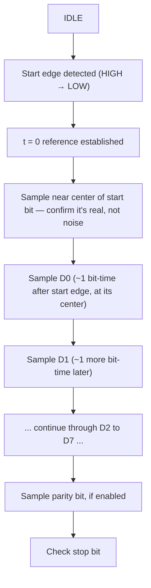

---

## 15. Oversampling: More Timing Resolution, Not More Data

Real UART hardware doesn't necessarily wait exactly N microseconds and check once — it typically runs its internal clock **faster** than the bit period, a technique called **oversampling** (commonly 8x or 16x).

If a bit period is 100 µs, and the UART uses 16x oversampling:

```text
100 µs / 16 = 6.25 µs   (internal timing tick interval)
```

**What this does and does not mean:**

❌ It does **not** mean the receiver captures 16 separate final data bits.

✅ It means the receiver gets **multiple internal timing opportunities** within each bit period, used for:

- **Start-bit detection** — confirming a real edge versus a brief noise glitch.
- **Timing alignment** — more accurately locating the true center of each bit.
- **Noise filtering** — some implementations take several internal samples and filter out transient noise.
- **Majority-vote decisions** — checking several ticks near the center and going with whichever value appears most.

```text
5 internal samples taken near the bit's center: 1, 1, 1, 0, 1
Majority = 1 (four 1s vs. one 0)
→ Final decision: this bit = 1
```

> **Important caveat:** the exact sampling algorithm — how many internal ticks, whether majority voting is used — is implementation-specific to the particular UART peripheral hardware. Don't say "UART samples 16 bits" — say "oversampling improves timing resolution."

---

## 16. Clock Mismatch: Why Perfect Timing Isn't Guaranteed

The transmitter has its own clock; the receiver has its own, separate clock. Both aim for the same baud rate, but real-world clocks are never *perfectly* identical.

```text
Sender's actual bit time:   100 µs
Receiver's assumed bit time: 101 µs   (a small clock error)
```

```text
Transmitter's actual bit boundaries:  0, 100, 200, 300, 400, 500 µs...
Receiver's assumed bit boundaries:    0, 101, 202, 303, 404, 505 µs...
```

The two timelines start together (thanks to the start bit) but slowly drift apart across the frame. By the 8th data bit, the receiver's sampling point can be noticeably off from where the bit actually is.

**How this is managed in practice:**

- **Center sampling** provides built-in tolerance — the point furthest from both edges.
- **Every new frame re-synchronizes timing from scratch**, via a fresh start bit. Drift never accumulates across multiple bytes — it resets every time.
- This is why **frames are kept short** (typically 10–12 bits total) rather than one long unbroken bit stream, and why **baud rate accuracy** genuinely matters, especially at higher speeds where each bit period is short and margin is thin.

**Analogy:** two people timing each other with their own slightly-imperfect watches. Over a short 8-second sequence, the error barely matters. Let the same watch run indefinitely without resetting, though, and the error keeps growing. UART "resets the watch" at the start of every byte — which is exactly why small clock mismatch rarely causes trouble in practice.

---

## 17. Parity: A Simple Honesty Check

Back at the warehouse: Warehouse B wants a cheap, simple way to catch *some* delivery mistakes — not a perfect guarantee, just a basic sanity check. The rule: count the total number of "special" boxes (1-bits), plus one extra check-box chosen to make that count come out a certain way. That's parity.

**Even parity**: total number of 1s across data + parity bit must be **even**.
**Odd parity**: that same total must be **odd**.

### Example 1 — `10110010`

```text
Count of 1s: 4 (even)
Even parity → parity bit = 0   (total stays 4, even)
Odd parity  → parity bit = 1   (total becomes 5, odd)
```

### Example 2 — `10110000`

```text
Count of 1s: 3 (odd)
Even parity → parity bit = 1   (total becomes 4, even)
Odd parity  → parity bit = 0   (total stays 3, odd)
```

### ⚠️ A very important clarification

❌ **Wrong idea:** "A parity bit value of 0 always means even parity."

✅ **Correct rule:** even/odd parity describes the *rule* used to choose the bit's value, not the value itself. Notice above — the parity bit came out as `0` in one case and `1` in the other, purely because the data's 1-count differed.

The receiver recalculates parity on the received data and compares against the agreed rule. A mismatch raises a **parity error** — a signal something on the wire may have been corrupted. Worth being honest about the limits: parity reliably catches a single flipped bit, but if two bits flip in a way that cancels out, parity can miss it entirely. It detects some errors. It doesn't guarantee data integrity, and it never corrects anything.

---

## 18. 8N1, 8E1, 8O1: Reading the Shorthand

| Shorthand | Data bits | Parity | Stop bits |
|---|---|---|---|
| **8N1** | 8 | None | 1 |
| **8E1** | 8 | Even | 1 |
| **8O1** | 8 | Odd | 1 |

```text
8N1:   IDLE | START | D0 D1 D2 D3 D4 D5 D6 D7 | STOP | IDLE

8E1:   IDLE | START | D0 D1 D2 D3 D4 D5 D6 D7 | EVEN-PARITY | STOP | IDLE

8O1:   IDLE | START | D0 D1 D2 D3 D4 D5 D6 D7 | ODD-PARITY  | STOP | IDLE
```

`8N1` is by far the most common configuration in everyday embedded work — simple, and the extra bit usually isn't needed.

---

## 19. Does the Receiver Automatically Know the Sender's Format?

**Normally, no.** UART configuration is a **pre-arranged agreement**, set in software on both sides *before* communication begins. The sender never transmits "I am using 8E1" — it just sends bits, in a fixed order, at a fixed speed.

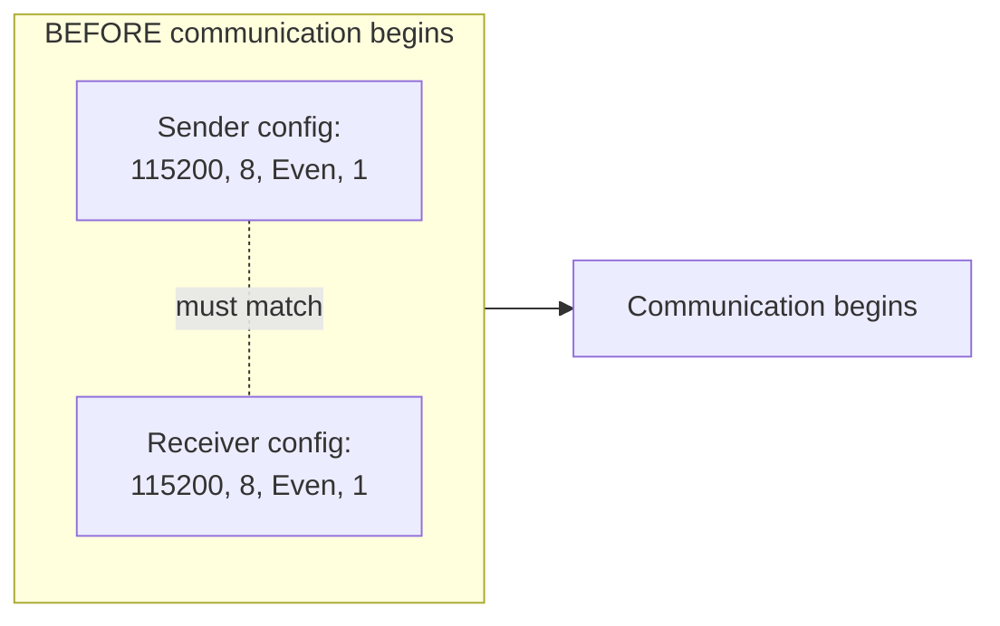

```text
Sender:    115200, 8E1
Receiver:  115200, 8E1     →  matches — communication works

Sender:    115200, 8E1
Receiver:  115200, 8O1     →  mismatch — parity checks fail;
                               depending on severity, data bits
                               may be misread too
```

**Baud-rate mismatch (e.g., 9600 vs. 115200)** is the most severe case — the receiver samples at completely wrong timing points, and the result is essentially garbage data. In unlucky cases a byte can even *appear* superficially plausible while actually being fully corrupted — a particularly misleading failure mode.

Some UART hardware supports **auto-baud detection** — measuring the timing of an initial known pattern to estimate baud rate. This is a specific, deliberately-implemented feature, not something every UART peripheral does automatically, and it typically only estimates baud timing — not the full frame format (parity, stop bits), which still needs separate configuration.

---

## 20. The Stop Bit: Closing the Frame

```text
START → DATA → [PARITY] → STOP
```

The stop bit returns the line to (and holds it at) the idle HIGH level for at least one bit period. This marks the end of the current frame and re-establishes idle, so the receiver is ready to detect the *next* start bit whenever it comes.

If the receiver expects HIGH at the stop-bit position but finds LOW instead, that's a **framing error** — a strong sign of timing drift or a wrong baud rate. Configuration commonly allows 1, 1.5, or 2 stop bits; one is by far the most common, and more stop bits simply trade a bit of "recovery time" for slightly lower throughput.

---

## 21. Following One Complete Byte, Start to Finish

This is the centerpiece of the whole article. Let's trace a single byte, `0xB2`, configured as `115200 8E1`, from the moment an application decides to send it to the moment another application receives it.

```text
 1. Application calls something like uart_write(0xB2).
 2. The driver hands the byte to the UART peripheral.
 3. UART hardware begins assembling a frame around this byte.
 4. UART calculates the parity bit (even rule): count of 1s = 4 → parity = 0.
 5. UART places the start bit on the line (line drops LOW).
 6. UART transmits D0.
 7. UART transmits D1.
 8. UART transmits D2.
 9. UART transmits D3.
10. UART transmits D4.
11. UART transmits D5.
12. UART transmits D6.
13. UART transmits D7.
14. UART transmits the parity bit.
15. UART transmits the stop bit (line returns HIGH).
16. The electrical signal physically travels along the wire.
17. The receiving device's RX pin observes the changing voltage.
18. UART hardware on the receiving side detects the falling-edge start.
19. The receiver anchors its internal timing to that instant.
20. The receiver samples each bit at its calculated center point.
21. The receiver reconstructs the full byte from the sampled bits.
22. The receiver checks received parity against its own recalculation.
23. The receiver checks that the stop-bit position is HIGH as expected.
24. The completed byte is pushed into the RX FIFO.
25. An interrupt (or DMA) notices the new byte and acts on it.
26. The byte is moved into RAM.
27. The driver makes the byte available to the receiving application.
```

### Animated-style walkthrough

**Frame 1 — Idle**

```text
TX ───────────────────────────── HIGH
```

**Frame 2 — Start bit**

```text
TX ────────────────┐
                    └──────── LOW
```

**Frame 3 — First data bit (D0 = 0)**

```text
START | D0
  ↓     ↓
 LOW   LOW
```

**Frame 4 — D1 = 1**

```text
D0 | D1
 ↓    ↓
LOW  HIGH
```

...and so on through D2–D7, then parity, then the stop bit — each simply the line sitting at a particular voltage for one bit period, in sequence. Once the stop bit passes:

```text
RX
 ↓
UART hardware (samples, decodes, checks parity/stop)
 ↓
FIFO
 ↓
DMA (or interrupt-driven copy)
 ↓
RAM
```

### The Master Timing Diagram

```text
        IDLE   START   D0    D1    D2    D3    D4    D5    D6    D7   PARITY  STOP   IDLE
        HIGH    LOW     0     1     0     0     1     1     0     1     0     HIGH   HIGH
       ─────┐  ┌───┐  ┌───┐        ┌───┐  ┌───┐              ┌───┐         ┌──────────────
            │  │ ● │  │ ● │  ●     │ ● │  │ ● │  ●     ●     │ ● │  ●      │
            └──┘   └──┘   └────────┘   └──┘   └─────────────┘   └─────────┘
                   ↑ each ● marks the sampling instant near the center of its bit
```

### As a Mermaid sequence and state machine

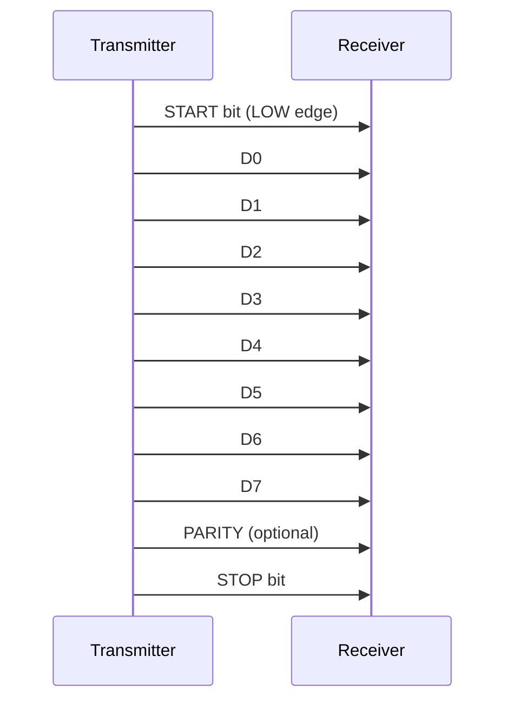

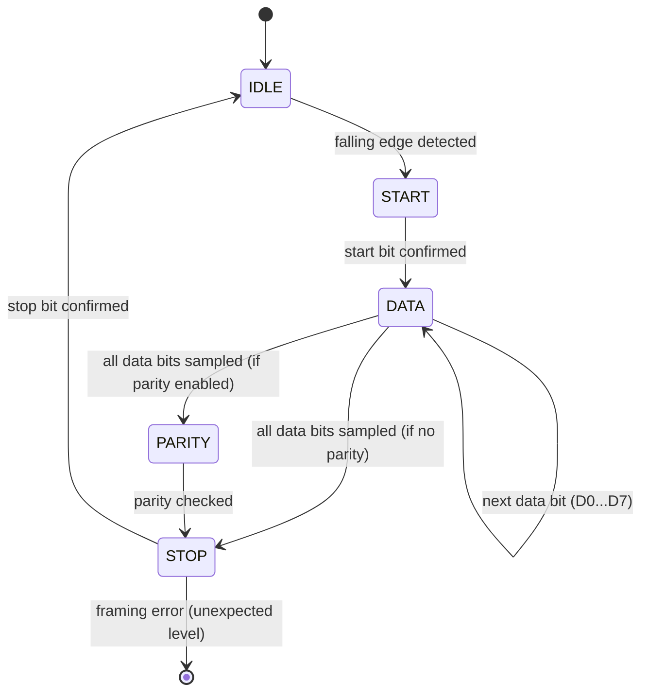

---

## 22. Why UART Needs a FIFO

Imagine bytes arriving at Warehouse B faster than the manager can personally process each one. Without a buffer, boxes would need to be handled the instant they arrive, or be lost.

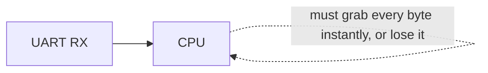

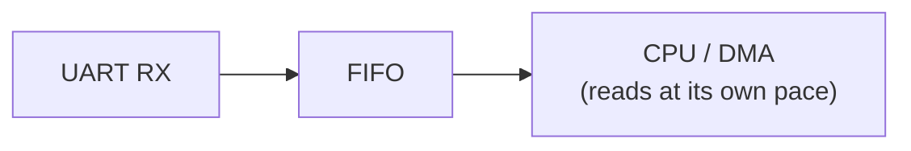

**FIFO** = **First In, First Out** — a small buffer, right inside the UART peripheral:

```text
+----+----+----+----+----+
| B0 | B1 | B2 | B3 | B4 |
+----+----+----+----+----+
  ↑ oldest byte, next to be read out
```

This is exactly Warehouse B's receiving shelf — boxes can pile up briefly even if the manager is momentarily busy, as long as the shelf doesn't fill faster than it's emptied. Most UART peripherals have both an **RX FIFO** and a **TX FIFO**, letting software queue several outgoing bytes without babysitting each individual bit.

If the FIFO fills up completely before anything is read out, you get an **overrun error** — bytes get silently dropped because there's nowhere left to put them.

---

## 23. Interrupts: "Tell Me When Something Happens"

The manager at Warehouse B could walk to the shelf every few seconds and ask, "did anything arrive?" — repeatedly, even when the shelf is empty. This is **polling**, and it wastes time.

A better system: the receiving department *notifies* the manager the instant something arrives. That notification is an **interrupt**.

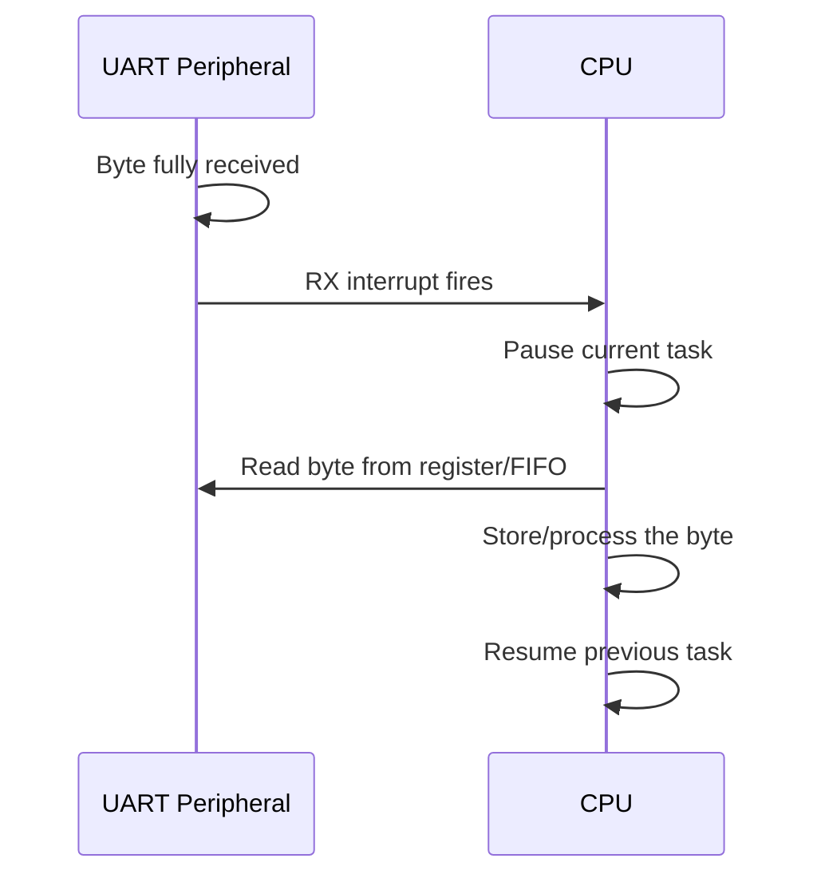

Common interrupt types:

| Interrupt | Fires when... |
|---|---|
| **RX interrupt** | A new byte has been received |
| **TX empty interrupt** | TX register/FIFO is empty and ready for more data |
| **RX FIFO threshold interrupt** | A configured number of bytes has accumulated (read several at once, not one at a time) |
| **Break / error interrupt** | An error condition (parity, framing, overrun) occurs |

Interrupts free the CPU to do other useful work and only get involved exactly when there's something worth handling. But getting a *separate* interrupt for every single byte still means the CPU repeatedly pauses and resumes ("context switches") — at high baud rates, over large data volumes, this overhead adds up. That's precisely the problem DMA exists to solve. Polling still has its place for very simple, predictable, low-overhead, or extremely resource-constrained scenarios — it's a tradeoff, not "interrupts always win."

---

## 24. DMA: A Worker Who Moves Boxes Without Bothering the Manager

Warehouse B suddenly needs to handle 10,000 boxes in one delivery. The manager absolutely should not personally carry every one — that would consume the entire day. Instead, a dedicated worker handles the physical moving. That worker is **DMA — Direct Memory Access**.

```text
UART       = the loading/unloading dock
DMA        = a warehouse worker who physically moves boxes into storage
RAM        = the warehouse
CPU        = the manager, who gives instructions but doesn't carry boxes
```

```text
Without DMA:   UART → CPU → RAM     (CPU personally shuttles every byte)
With DMA:      UART → DMA → RAM     (a separate mechanism moves the bytes;
                                       CPU is freed for other work)
```

### UART without DMA — receiving 100 bytes

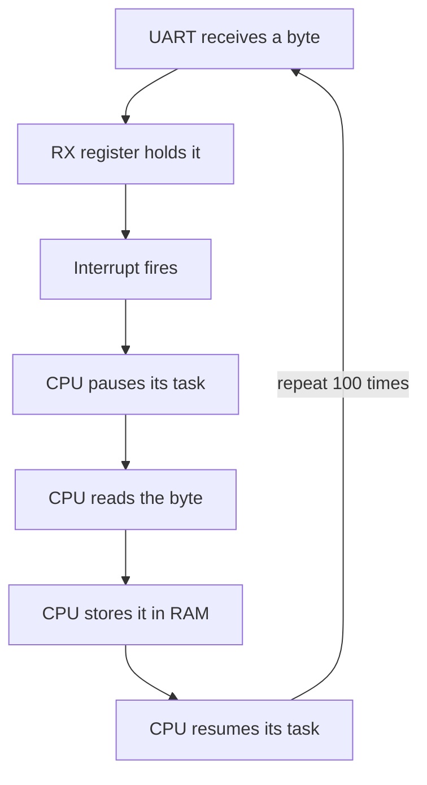

For every one of the 100 bytes, interrupt handling, context save/restore, and the copy itself all repeat separately. At higher baud rates this overhead becomes a real bottleneck.

### UART with DMA — receiving 100 bytes

DMA is configured once: `Source = UART RX register, Destination = RAM buffer, Length = 100 bytes, Direction = peripheral → memory`.

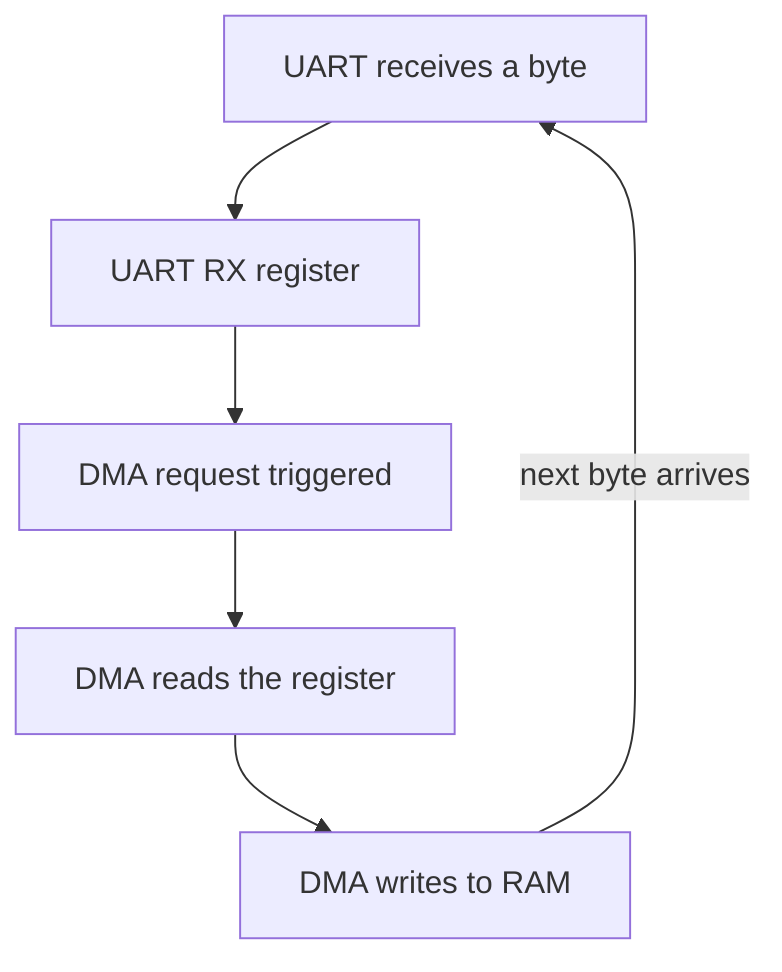

The CPU is free to do other work while this repeats automatically. At the end, DMA fires a single "transfer complete" interrupt — not one per byte — and the CPU processes the whole buffer at once.

**The key point:** the CPU **configures** DMA once, upfront. DMA performs the actual repetitive transfer.

### The DMA request, concretely

```text
UART receives a byte
 ↓
RX data-ready event (internal hardware signal)
 ↓
DMA request (peripheral signals the DMA controller: "I need attention")
 ↓
DMA transfer occurs
```

| Term | Meaning |
|---|---|
| **DMA request** | Signal from a peripheral asking the DMA controller to move data |
| **DMA channel** | A dedicated resource/path within the controller for one specific transfer; multiple channels let multiple peripherals use DMA simultaneously |
| **DMA controller** | The hardware block that actually manages and executes transfers |

> Exact DMA architecture (channel count, which peripherals support it) differs across MCU families and even across chip variants within the same family — always check the specific datasheet.

---

## 25. What DMA Does *Not* Do (An Important Misconception)

**DMA does NOT:**
- detect the start bit
- sample the wire
- calculate UART timing
- decide the parity bit
- detect the stop bit

All of that is the job of the **UART hardware itself**. DMA only enters the picture *after* the UART peripheral has already fully decoded a valid byte and placed it in the FIFO. DMA's entire job is moving already-finished data from point A to point B.

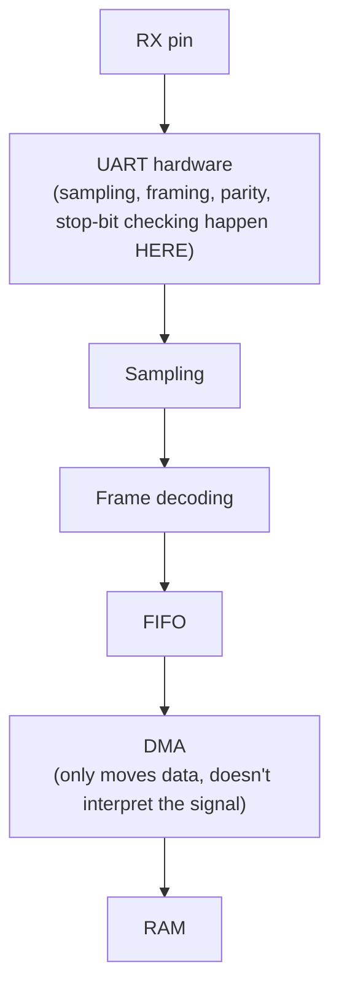

Back at the warehouse: the worker moving boxes from shelf to storage doesn't inspect the boxes or verify their contents — that's already handled by the receiving department before the worker ever touches anything.

### UART RX with DMA

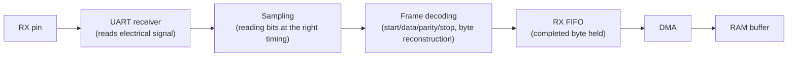

### UART TX with DMA

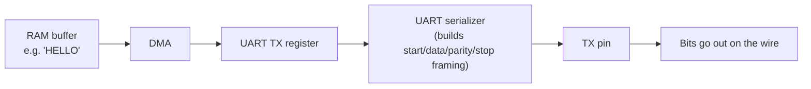

Again: **DMA moves bytes. UART creates the serial frame.** They are cleanly separated jobs — DMA at the data-movement layer, UART at the framing/timing layer.

---

## 26. CPU vs. UART vs. FIFO vs. Interrupt vs. DMA — A Clean Summary

| Component | What it actually does |
|---|---|
| **UART hardware** | Timing, framing, sampling, parity checking, serialization/deserialization |
| **FIFO** | Temporary buffering — absorbs bursts and mismatched processing speeds |
| **Interrupt** | Notification — tells the CPU "something needs attention now" |
| **DMA** | Bulk data movement between peripheral and memory, without CPU babysitting |
| **CPU** | Configuration, control, higher-level parsing, application logic |
| **RAM** | Storage for received/pending data |
| **Protocol parser (software)** | Assigns *meaning* to the raw bytes |

> **The core mental model:** UART decides "what was sent/received" (timing layer). DMA decides "how it physically moves from A to B" (movement layer). CPU decides "what it means" (meaning layer). Three distinct layers — and a well-designed driver keeps them cleanly separated.

---

## 27. Bringing It Into Real Hardware: ESP32

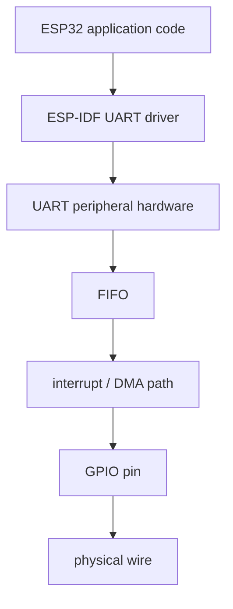

"ESP32" refers to a whole family of chips (original ESP32, ESP32-S2, ESP32-S3, ESP32-C3, ESP32-C6, and others). Exact UART peripheral capabilities — number of UART ports, FIFO depth, DMA support details — differ between variants. Don't assume every ESP32-branded chip behaves identically; always check the specific datasheet.

### A typical ESP-IDF UART configuration

```c
// Conceptual — exact API names/parameters can vary across ESP-IDF
// versions and ESP32 variants. Always verify against the official docs.

uart_config_t uart_config = {
    .baud_rate = 115200,               // bit_time = 1/115200 ≈ 8.68 µs per bit
    .data_bits = UART_DATA_8_BITS,     // 8 data bits (D0–D7)
    .parity    = UART_PARITY_DISABLE,  // No parity → the "N" in 8N1
    .stop_bits = UART_STOP_BITS_1,     // 1 stop bit
    .flow_ctrl = UART_HW_FLOWCTRL_DISABLE,
};
```

In plain language:

- `baud_rate = 115200` — the foundation of the receiver's bit-timing calculation; both sides must match exactly.
- `data_bits = UART_DATA_8_BITS` — how many sampling decisions the receiver makes, and how to reassemble the byte.
- `parity = UART_PARITY_DISABLE` — no parity bit; this is effectively "8N1."
- `stop_bits = UART_STOP_BITS_1` — one stop bit closes each frame.
- `flow_ctrl = UART_HW_FLOWCTRL_DISABLE` — no hardware flow control (RTS/CTS lines that let one side tell the other "pause") in this configuration.

### The complete ESP32 receive path

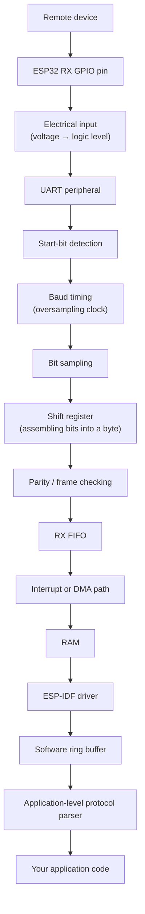

Every layer has a distinct job — and, importantly, a bug can hide at *any* of them. Knowing this full path turns "my ESP32 UART doesn't work" from a mystery into a systematic search.

---

## 28. Ring Buffers: Decoupling Producer and Consumer Speed

Why does the ESP-IDF driver add its own **ring buffer** on top of the hardware FIFO? Because the hardware FIFO is small (often just a few dozen bytes), while your application might not read at a perfectly steady pace.

A ring buffer is a fixed-size buffer where writing and reading wrap around continuously:

```text
+----+----+----+----+----+----+
|    |    |    |    |    |    |
+----+----+----+----+----+----+
       ↑                  ↑
      tail              head
  (consumer reads      (producer writes
   from here)            here)
```

- The **producer** (UART/DMA, pushing newly received bytes) writes at the **head**.
- The **consumer** (your application, reading bytes out) reads from the **tail**.
- When either pointer reaches the end of the buffer, it wraps back to the beginning — hence "ring."

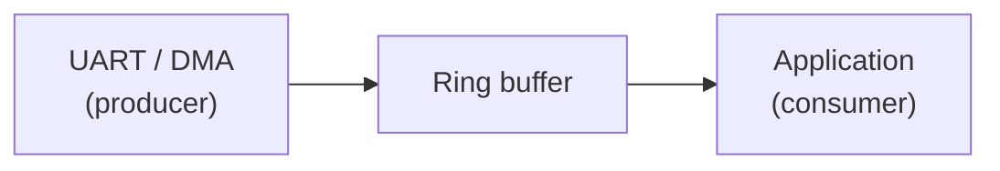

This lets the UART hardware keep receiving data even if your application is momentarily busy, as long as it catches up before the buffer fills.

**Analogy:** a circular storage rack. New parcels are placed on one side (head); older parcels are picked up from the other side (tail). Because the rack is circular, freed space is reused without needing to build new shelves.

---

## 29. UART Doesn't Know What Your Message Means

**UART only knows about bits, frames, and bytes. It has zero built-in understanding of what those bytes mean.**

Suppose you receive:

```text
AA 05 01 20 30 CRC
```

UART's job ends at handing you these raw bytes. It has no idea `AA` marks a packet start, `05` is a length field, `01` is a command code, `20 30` is a payload, and the last byte is a checksum. *Your* application-level protocol assigns that meaning — UART just delivered the bytes faithfully.

This is the distinction between the **transport/framing layer** (UART's job: get bits across a wire reliably) and the **application protocol layer** (your job: decide what a sequence of bytes represents). Confusing these two layers is a common design mistake — a UART framing error and a corrupted application packet are genuinely different problems, at different layers, needing different debugging approaches.

### A worked ESP32 example

```text
AA 05 01 10 20 30 CRC
```

- `AA` — START marker
- `05` — LENGTH (how many payload bytes follow)
- `01` — COMMAND (e.g., "temperature reading")
- `10 20 30` — PAYLOAD
- `CRC` — checksum, for data-integrity verification

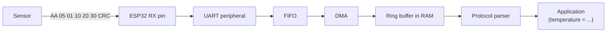

UART handles raw byte transport only — reliably delivering `AA, 05, 01, 10, 20, 30, CRC` in order, with correct timing. Recognizing `AA` as a start marker, reading the length, extracting the payload, and checking the CRC are all the application protocol's job.

---

## 30. Errors: What Can Go Wrong, and How Each Layer Sees It

| Error | What happened | Hardware sees | Driver sees | Application sees |
|---|---|---|---|---|
| **Parity error** | Recalculated parity didn't match the received parity bit | Flags a parity-error condition | Reports error via status/flag | Possibly corrupted or dropped data |
| **Framing error** | Stop-bit position wasn't HIGH as expected | Flags a framing error | Reports error via status/flag | Garbled or missing bytes |
| **Overrun** | FIFO filled up before software read it | New bytes dropped, error flag set | Reports overrun condition | Missing bytes, often invisible unless checked |
| **Noise error** *(where supported)* | Oversampling ticks disagree with each other | May flag inconsistent samples | Reports noise condition, if supported | Occasional corrupted bytes |
| **Break condition** | Line held LOW far longer than a normal frame | Detected as a distinct "break" event | May report as a distinct event | Depends on application handling |
| **Clock mismatch** | Baud rate not precisely matched between TX/RX | Sampling points drift within a frame | Elevated framing/parity error rate | Data looks "randomly" corrupted |
| **DMA buffer overflow** | RAM buffer fills before software processes it | N/A (above the UART hardware layer) | DMA/driver reports buffer full | Data loss, possibly silent if unchecked |

To find where a problem actually lives, an engineer checks status flags at the hardware/driver level rather than guessing purely from symptoms visible in the application.

---

## 31. Debugging UART in the Real World

**"The ESP32 prints garbage characters."** A beginner reaction is "check the baud rate" — a great first guess, but a real engineer works through possibilities systematically:

- **Wrong baud rate** — the single most common cause.
- **Wrong parity setting** — one side expects parity, the other doesn't (or they disagree on even/odd).
- **Wrong data bit count** — rare, but possible (7 vs. 8 bits).
- **Wrong stop bit count** — less common, but possible.
- **TX/RX swapped** — a very frequent wiring mistake.
- **Missing common ground** — voltage references don't match, corrupting the signal.
- **Electrical level mismatch** — e.g., a 5V device on a 3.3V-only GPIO without level shifting.
- **Electrical noise** — long or unshielded wires, especially at higher baud rates.
- **Clock inaccuracy** — a cheap or poorly calibrated oscillator drifting from the nominal baud rate.
- **Wrong higher-level protocol assumptions** — framing is fine, but the application misinterprets correctly-received bytes.
- **FIFO overflow** — data arriving faster than it's drained.
- **Driver misconfiguration or a plain software bug.**

### A few concrete mismatch scenarios

**Sender 115200 8N1, Receiver 9600 8N1** — the receiver's timing is based on the wrong baud rate; it samples at completely wrong moments. Result: garbage data or repeated framing errors, because the receiver's assumed bit_time (≈104 µs) is wildly different from the sender's actual bit_time (≈8.68 µs).

**Sender 115200 8E1, Receiver 115200 8O1** — baud rate and data bits match, but the parity rule doesn't. The receiver sees continuous parity errors, because the sender generates parity under an even-parity rule while the receiver checks it against an odd-parity rule.

**TX connected to TX** — both sides are only "talking"; nobody is "listening." No communication happens at all, and on some hardware two outputs fighting on the same wire can create electrical stress.

**RS-232 wired directly into an MCU GPIO** — RS-232 voltage levels are far wider than 3.3V logic and can damage the GPIO permanently — exactly why a level-shifting transceiver is required (Section 6).

**Randomly corrupted bytes** — investigate, in roughly this order: baud rate match, common ground connected, TX/RX properly crossed, then move to subtler causes (clock accuracy, electrical noise, buffer overflow, parsing bugs).

The point isn't to memorize this list — it's to internalize the *approach*: work outward from the electrical layer, through UART hardware, through the driver, to the application. That's exactly the layered map from Section 27.

---

## 32. Logic Analyzers: Making the Invisible Visible

A **logic analyzer** taps onto your TX (or RX) line and decodes the digital signal, often with built-in UART decoding.

```mermaid
flowchart LR
    A[TX line] --> B[Logic Analyzer]
    B --> C["Decoded UART frames<br/>(shown as bytes, with timing)"]
```

With a logic analyzer you can directly, visually verify: whether idle is actually HIGH as expected, whether the start bit is present and correctly timed, the actual width of each bit (confirming the real baud rate in use), the actual data bit order and values, whether parity is present and correct, and whether the stop bit is where it should be.

This tool is enormously valuable because it turns a confusing, invisible software mystery into something you can literally look at. "My data is corrupted" becomes "the bit width is 8.9 µs, not 8.68 µs — the baud rate is slightly off."

---

## 33. Oscilloscopes: When It's an Electrical Problem, Not a Logic Problem

A logic analyzer shows a clean digital interpretation — HIGH or LOW. An **oscilloscope** shows the raw analog waveform: actual voltage, over actual time, including every messy in-between detail.

Reach for an oscilloscope when you suspect: voltage levels aren't reaching a proper HIGH or LOW, the signal is noisy or spiking, edges are unusually slow or "rounded," there's ringing or overshoot after a transition, or the electrical integrity of the signal itself is in question.

| | Logic analyzer | Oscilloscope |
|---|---|---|
| **View** | Digital protocol decode | Raw analog waveform |
| **Best for** | Confirming framing, timing, bit values | Confirming voltage levels, signal quality |
| **Typical question answered** | "Is the byte sequence correct?" | "Is the electrical signal clean?" |

They're complementary, not competing — one answers "is my protocol correct," the other answers "is my electrical signal healthy."

---

## 34. Driver-Level Thinking: How a Senior Engineer Approaches UART

A senior embedded engineer mentally separates UART into distinct layers, and — crucially — keeps them separate in code:

```mermaid
flowchart TD
    A["Electrical layer<br/>(voltage, logic levels, transceivers)"] --> B["UART peripheral<br/>(framing, sampling, timing)"]
    B --> C["FIFO<br/>(temporary buffering)"]
    C --> D["DMA / Interrupt<br/>(data movement / notification)"]
    D --> E["Driver<br/>(low-level software management)"]
    E --> F["Ring buffer<br/>(accumulated raw bytes)"]
    F --> G["Protocol parser<br/>(message structure recognition)"]
    G --> H["Application<br/>(business logic / meaning)"]
```

The UART driver **does not need to know** "this byte represents a temperature value." Its job is only to reliably move and buffer bytes:

- **UART driver** — moves bytes, handles raw hardware errors.
- **Protocol parser** — recognizes "message structure" within those bytes (e.g., "these 5 bytes form one complete packet").
- **Application** — determines the actual meaning ("this is a temperature reading of 25°C").

If these layers get mixed together (e.g., temperature-parsing logic embedded directly inside the UART driver), the code stops being reusable, and a change in one layer can unexpectedly break another.

---

## 35. What Experienced Embedded Engineers Notice

- **UART is fundamentally a timed state machine** — every frame walks IDLE → START → DATA → (PARITY) → STOP → IDLE, and each state's duration is set by the baud rate.
- **The wire doesn't understand bytes** — meaning is entirely reconstructed by agreed-upon timing and framing rules.
- **The start bit's only job is establishing a shared reference moment in time** — nothing more.
- **Sampling is a timing decision, not a continuous process** — the receiver checks specific instants, not the whole waveform.
- **Center sampling maximizes timing margin** against clock error and signal transitions.
- **Oversampling improves timing resolution** — unrelated to data bit count.
- **Clock mismatch causes sampling drift that accumulates across a frame** — this is why frames stay short and re-synchronize every byte.
- **Parity detects some errors; it does not correct them**, and can miss certain error patterns entirely.
- **FIFO solves burstiness** — short-term mismatches between arrival rate and processing rate.
- **Interrupts solve notification** — avoiding wasteful polling.
- **DMA solves repetitive data movement**, freeing the CPU from manually shuttling every byte.
- **DMA doesn't make UART faster** — it reduces CPU involvement; the transmission speed is still governed by baud rate.
- **UART hardware performs all framing and sampling** — DMA never touches the raw electrical signal.
- **UART has no concept of your application's packet structure** — that's a separate design layer built on top.
- **RS-232 is an electrical standard, not the same thing as UART's framing/timing behavior.**
- **Ring buffers decouple producer and consumer timing**, letting each side operate at its own pace within limits.
- **Real debugging spans electrical, peripheral, driver, and application layers** — knowing which layer you're looking at is half the battle.

---

## 36. UART vs. I2C vs. SPI (Briefly)

| | UART | I2C | SPI |
|---|---|---|---|
| **Topology** | Point-to-point (one device to one device) | Shared bus, multiple devices | Multiple devices via separate chip-select lines |
| **Clock wire** | None (asynchronous) | Shared clock line | Shared clock line |
| **Addressing** | None needed (dedicated wires per pair) | Address-based (each device has an ID) | Chip-select based (a dedicated select line per device) |
| **Typical wire count** | 2–3 (TX, RX, GND) | 2 (shared SDA + SCL, for any number of devices) | 4+ (grows with each additional device's chip-select) |
| **Relative complexity** | Simple | Moderate | Moderate |

Despite being conceptually simpler in some ways, UART remains extremely useful precisely *because* it's point-to-point, needs no shared bus with addressing logic, and is universally supported — often the very first thing engineers reach for when bringing up a new board, debugging via a console, or connecting two independent devices with no bus topology needed.

---

## 37. Common Misunderstandings ("UART Myths")

| # | Misconception | Correction |
|---|---|---|
| 1 | UART = RS-232 | UART is a framing/protocol layer; RS-232 is a separate electrical standard. Related, not the same thing. |
| 2 | TX should connect to TX | TX must always connect to the *other side's* RX. |
| 3 | The receiver automatically knows 8N1/8E1/8O1 | Configuration must be agreed upon in advance — never announced on the wire. |
| 4 | Sampling means continuously reading the signal | Sampling checks the signal's value at specific, chosen instants — not continuously. |
| 5 | Sampling happens "between" bits | It happens *inside* each bit's window, ideally near its center. |
| 6 | Parity bit = 0 always means even parity | The parity rule applies to the *total count* of 1s (data + parity), not the parity bit's own value in isolation. |
| 7 | DMA receives UART data directly from the wire | UART hardware performs all sampling and decoding; DMA only moves already-decoded bytes. |
| 8 | DMA is "another CPU" | DMA is a pre-configured data-movement mechanism — it doesn't make decisions, it just moves data as instructed. |
| 9 | 16x oversampling means 16 data bits | It means 16 internal timing ticks per bit period, purely for timing precision — not extra payload. |
| 10 | FIFO and DMA are the same thing | FIFO is temporary storage (a "place"); DMA is a data-movement mechanism (a "process"). |
| 11 | Interrupts and DMA are the same thing | An interrupt notifies the CPU; DMA moves data without needing active CPU involvement. Often used together, but distinct. |
| 12 | UART defines what my packets mean | UART only delivers raw bytes reliably; your application protocol defines what those bytes represent. |

---

## 38. UART in One Page — The Cheat Sheet

```text
UART   →  Universal Asynchronous Receiver / Transmitter
TX     →  Transmit pin (data out)
RX     →  Receive pin (data in)
GND    →  Shared ground reference — required for reliable signaling

Baud rate    →  Agreed bits-per-second speed; bit_time = 1 / baud_rate
Start bit    →  Single LOW bit; establishes timing reference for the frame
Data bits    →  Payload (commonly 8), sent LSB-first
Parity bit   →  Optional lightweight error-detection check (even/odd)
Stop bit     →  Returns line to idle HIGH; marks end of frame

Sampling      →  Checking voltage at a specific instant (ideally bit-center)
Oversampling  →  Finer internal timing resolution for accurate sampling
                  (NOT extra data bits)

FIFO       →  Small hardware buffer absorbing short-term bursts
Interrupt  →  Hardware notification, avoids wasteful CPU polling
DMA        →  Bulk data mover between peripheral and RAM (no CPU per-byte work)
RAM        →  Where received data ultimately lives for software to use
Driver     →  Software layer managing the UART peripheral + buffers
Ring buffer     →  Decouples producer (UART/DMA) timing from consumer (app) timing
App protocol    →  Defines the *meaning* of the raw bytes UART delivers

Remember:
  - UART builds the frame; DMA does not perform sampling.
  - Configuration (baud, data bits, parity, stop bits) must be agreed in advance.
  - TX always connects to the other side's RX.
  - UART ≠ RS-232 (different electrical standards).
```

---

## 39. The Full System, End to End

```mermaid
flowchart TD
    subgraph RX_PATH["RX PATH"]
    R1[Remote Device TX] --> R2[ESP32 RX pin]
    R2 --> R3[Electrical input]
    R3 --> R4["UART peripheral:<br/>start / sample / decode / parity / stop"]
    R4 --> R5[RX FIFO]
    R5 --> R6[DMA]
    R6 --> R7[RAM]
    R7 --> R8[Driver]
    R8 --> R9[Ring Buffer]
    R9 --> R10[Protocol Parser]
    R10 --> R11[Application]
    end

    subgraph TX_PATH["TX PATH"]
    T1[Application] --> T2["Protocol Parser<br/>builds message"]
    T2 --> T3[Driver]
    T3 --> T4[RAM buffer]
    T4 --> T5[DMA]
    T5 --> T6[UART TX register]
    T6 --> T7["UART serializer<br/>builds frame"]
    T7 --> T8[ESP32 TX pin]
    T8 --> T9[Remote Device RX]
    end
```

---

## 40. Final Knowledge Check

**Beginner level**

1. What problem does UART fundamentally solve?
2. Why doesn't UART require a shared clock wire?
3. What does "idle state" mean for a UART line?
4. Why is the start bit necessary?
5. What are TX and RX, and why do they cross when wiring two devices?
6. What does "baud rate" mean, and how do you calculate the duration of one bit from it?
7. Why is UART sent least-significant-bit first?

**Intermediate level**

8. What does "sampling" mean in the context of UART?
9. Why is the middle of a bit period a good place to sample?
10. What happens if the receiver samples too close to a bit boundary?
11. What does even parity actually check for, and can a parity bit value of 1 always be read as "odd parity"?
12. What's the difference between 8N1, 8E1, and 8O1?
13. Can parity detect every possible error? Why or why not?
14. What is a stop bit actually for, beyond just "ending the frame"?
15. What causes a framing error?
16. Does the UART receiver automatically detect the sender's baud rate and format?

**Embedded engineer level**

17. What does oversampling actually improve?
18. Why does clock mismatch between transmitter and receiver matter, even when both are "close enough"?
19. Why does timing drift tend to worsen across a longer frame, and why does that keep UART frames short?
20. What problem does a FIFO solve?
21. What's the difference between polling and interrupt-driven reception?
22. What problem does DMA solve, specifically?
23. Does DMA sample the wire or detect start bits? Why or why not?
24. What's the actual difference between UART and RS-232, and why can't you safely wire RS-232 directly into most MCU GPIOs?
25. What role does a ring buffer play on top of the hardware FIFO?
26. Why doesn't UART "know" where your application's packet begins or ends?

**Senior / architecture level**

27. Walk through, step by step, what happens inside an MCU from the moment a byte's start bit hits the RX pin to the moment the application reads that byte.
28. In what situations might polling be a reasonable choice over interrupts, despite the CPU overhead?
29. Describe the difference between what a logic analyzer shows you and what an oscilloscope shows you, and give a scenario where you'd specifically need each.
30. Explain, in your own words, why "DMA does not decode UART" is an important distinction for debugging RX pipelines.
31. If two devices are configured identically (same baud, parity, stop bits) but you're still seeing intermittent framing errors, what would you investigate, and in what order?
32. Why might different chips in the same MCU family (e.g., different ESP32 variants) have meaningfully different UART/DMA capabilities?
33. Why does keeping the UART driver, protocol parser, and application logic in separate layers matter for long-term code maintainability?

---

## 41. The Real Beauty of UART

When you type a single character into a serial terminal and watch it appear on another device's screen, it looks like nothing happened — just a flicker, instant and unremarkable.

But now you know better. That flicker was a start bit dropping a line from HIGH to LOW to establish a shared moment in time. It was eight carefully ordered voltage states, each measured at a precisely calculated instant near its center, chosen specifically to survive small imperfections in two independently ticking clocks. It was a parity bit quietly checking for damage, a stop bit closing the door behind it, a FIFO absorbing the rush, an interrupt tapping the CPU on the shoulder, and — if the hardware was busy — a DMA controller quietly carrying the finished byte the rest of the way home, without ever once looking at what it meant.

None of that complexity is an accident, and none of it is wasted. Every piece exists because, at some point, an engineer looked at a single wire carrying nothing but voltage, and asked exactly the right question at exactly the right layer. That's what UART really is — not a protocol to memorize, but a small, elegant answer to a surprisingly deep problem: how do you make silence and voltage mean something, one bit at a time?