# UART — The Complete Deep Dive: From Zero to MCU Hardware and DMA

> Imagine you're sitting next to a senior embedded engineer who has spent 50 years debugging MCUs, serial buses, DMA controllers, and firmware drivers. This document is that conversation, written down — starting from "what even is a wire" and ending at "I can mentally trace one bit from a TX pin all the way into an application buffer."

---

## What This Document Teaches

By the end of this document, you will be able to mentally trace **one single bit** through its entire journey:

```
TX pin → wire → RX pin → input logic → start detection → timing →
sampling → shift register → parity check → stop check → FIFO →
DMA → RAM → driver → ring buffer → protocol parser → application
```

You will understand not just *what* UART is, but *why* every single piece of it exists — because nothing in engineering exists without a reason. Every design decision in UART was a solution to a real, physical problem.

**Prerequisites:** None, really. If you know that electricity can be "on" or "off," you can start. We will build everything else from there.

**Roadmap of this document:**

```
ABSOLUTE BEGINNER
       ↓
DIGITAL LOGIC
       ↓
SERIAL COMMUNICATION
       ↓
UART FUNDAMENTALS
       ↓
UART FRAME
       ↓
BAUD RATE
       ↓
BIT TIMING
       ↓
SAMPLING
       ↓
OVERSAMPLING
       ↓
CLOCK ERROR
       ↓
PARITY
       ↓
8N1 / 8E1 / 8O1
       ↓
ERRORS
       ↓
FIFO
       ↓
INTERRUPTS
       ↓
DMA
       ↓
UART RX/TX + DMA
       ↓
ESP32 UART
       ↓
DRIVER ARCHITECTURE
       ↓
RING BUFFER
       ↓
APPLICATION PROTOCOL
       ↓
DEBUGGING
       ↓
SENIOR ENGINEER MENTAL MODEL
```

Let's begin — before UART even existed as an idea.

---

## Section 1 — Why UART Exists

Before we talk about UART, let's forget it exists. Let's go back to the actual engineering problem.

Suppose you have two digital devices — call them **Device A** and **Device B** — and Device A needs to send Device B a single byte of data (8 bits).

The most obvious idea a beginner might have is: *"There are 8 bits — why not just connect 8 wires, one per bit, and send them all at the same time?"*

This is called **parallel communication**.

```text
PARALLEL COMMUNICATION

DATA BUS:
D7  D6  D5  D4  D3  D2  D1  D0
 |   |   |   |   |   |   |   |
 |   |   |   |   |   |   |   |
 ▼   ▼   ▼   ▼   ▼   ▼   ▼   ▼
─────────────────────────────►   (all 8 bits arrive at the exact same instant)
```

This sounds fast — all 8 bits travel simultaneously. But it comes with real, physical costs:

| Problem | Why it matters |
|---|---|
| **Pin count** | 8 bits need 8 wires. A 32-bit value needs 32 wires. MCU pins are a scarce and expensive resource. |
| **Distance / skew** | Over longer wires, tiny differences in wire length or capacitance cause bits to arrive at slightly different times — this is called **skew**. If skew is large enough, the receiver reads bits from *different moments in time* and reconstructs a corrupted byte. |
| **Cost & complexity** | More wires = thicker cables, more connector pins, more PCB routing, more cost. |

So engineers asked a different question: *"What if we send bits one after another, on a single wire, instead of all at once?"*

This is called **serial communication**.

```text
SERIAL COMMUNICATION

D7 → D6 → D5 → D4 → D3 → D2 → D1 → D0
(one wire, bits travel one after another, separated in TIME instead of SPACE)
```

**Real-world analogy:** Think of a wide 8-lane highway (parallel) versus a single narrow road (serial). The highway moves 8 cars at once but is expensive to build and maintain. The single road is cheap, but now the cars must travel in a queue, one after another — and everyone on the road must agree on *when* each car is allowed to pass.

**Why did serial communication become attractive?**
- Fewer wires → lower cost, less board space, smaller connectors.
- No parallel skew problem — much easier over longer distances.
- Simpler, more robust connectors — sometimes just 2–3 wires (TX, RX, GND).

But serial communication creates a brand-new problem that parallel communication didn't have:

> **If there's only one wire, and bits arrive one after another, how does the receiver know *when* one bit ends and the next one begins?**

This single question is the entire reason UART's internal design exists the way it does. Keep this question in your mind — every section from here forward is, in some way, answering it.

---

## Section 2 — What UART Actually Means

**UART = Universal Asynchronous Receiver/Transmitter**

Let's break this apart, word by word:

| Word | Meaning |
|---|---|
| **Universal** | Not tied to one fixed format — configurable baud rate, data bits, parity, stop bits |
| **Asynchronous** | No shared clock wire between sender and receiver |
| **Receiver** | The hardware block that receives incoming data (RX) |
| **Transmitter** | The hardware block that sends outgoing data (TX) |

The most important — and most misunderstood — word here is **Asynchronous**. Let's dig into it properly.

### What does "Asynchronous" really mean?

Some serial protocols solve the serial-communication timing problem by adding a **dedicated clock wire**. SPI is a good example:

```text
SPI (SYNCHRONOUS — has a clock wire)

SCLK  ──┐  ┌──┐  ┌──┐  ┌──►   (clock pulses tell both sides exactly when to read/write)
        └──┘  └──┘  └──┘
MOSI  ───────────────────►    (Master Out, Slave In)
MISO  <───────────────────    (Master In, Slave Out)
```

In SPI, every clock pulse says: *"Read/write one bit — right now."* Both sides are perfectly synchronized because they share the same clock signal.

UART takes a completely different approach:

```text
UART (ASYNCHRONOUS — NO clock wire)

TX ──────────────────────────► RX
   (only a data line — no shared clock)
```

**So how does UART handle timing without a shared clock?** This is the real meaning of "Asynchronous":

1. Both sides **agree in advance** on a communication speed (the **baud rate**), and on the frame format (data bits, parity, stop bits). This agreement happens in software/configuration, *before* any data is exchanged — much like two people agreeing beforehand: "I will say one word every second."

2. Each side has its **own independent local clock** (an internal oscillator inside the MCU). These clocks are not connected to each other, but they are configured to run at approximately the same rate (because both were told to use the same baud rate).

3. At the start of every single byte transmission, a special signal called the **start bit** is sent. This tells the receiver: *"A new frame is beginning right now — align your internal timing to this exact moment."*

4. From that reference point, the receiver uses its own local clock plus the known baud rate to predict *when* each subsequent bit will arrive, and reads (samples) the line at those predicted moments.

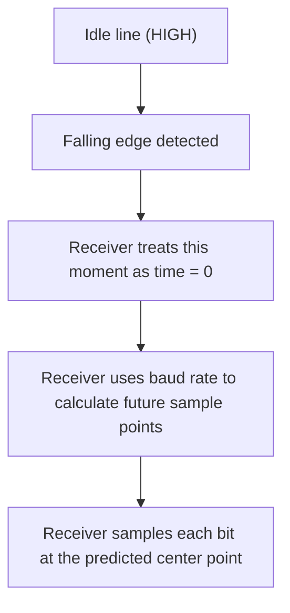

> **Key mental model:** UART doesn't share a clock — it shares an *agreement* about timing, and re-synchronizes that agreement at the start of every single frame using the start bit. This is the entire trick that makes "asynchronous" communication possible.

---

## Section 3 — UART Has Two Sides: TX and RX

Every UART connection has two independent directions of data flow:

```text
        MCU A                                MCU B

   UART TX  ──────────────────────────►   UART RX
   UART RX  ◄──────────────────────────   UART TX
```

- **TX (Transmit)** — this pin sends data *out* of the device.
- **RX (Receive)** — this pin receives data *into* the device.

**The golden rule:** TX on one device must connect to RX on the other device, and vice versa.

```text
✅ CORRECT:
MCU A TX ────────► MCU B RX
MCU A RX ◄──────── MCU B TX

❌ WRONG (classic beginner mistake):
MCU A TX ────────► MCU B TX   (both sides are "talking" — nobody is "listening"!)
MCU A RX ◄──────── MCU B RX
```

**Why is TX-to-TX wrong?** Both TX pins are electrical **outputs**. If you connect two outputs together, neither side ever gets data on its RX (input) pin — no communication happens at all. In some cases, two output drivers actively fighting each other on the same wire can also cause electrical stress on the pins. We'll return to this exact failure mode in the debugging section.

> **Tip:** Some pre-made cables or USB-to-UART adapters are already internally "crossed" so you just connect TX→TX, RX→RX on the labels — always check the specific board/adapter's documentation, because labeling conventions vary.

---

## Section 4 — UART's Electrical Signal

Before going further, we need to separate two ideas that beginners often confuse: **the UART protocol** (framing, timing, bit order) and **the electrical voltage standard** used to carry it.

> **UART ≠ RS-232.** This is one of the most common and consequential misunderstandings in embedded systems.

### Logic-level UART (e.g., ESP32) vs. RS-232

- **ESP32 UART (logic-level / TTL-CMOS style):** ESP32's UART GPIO pins operate in a **3.3V logic** context. Conceptually, voltage above a certain threshold is interpreted as logic HIGH (1), and voltage below a certain threshold is interpreted as logic LOW (0). The exact threshold values are chip-specific electrical characteristics and should always be verified against the official datasheet — we won't quote precise numbers here.

- **RS-232:** An older, different electrical standard, historically used for PC serial ports and industrial equipment. Its voltage levels are significantly different from — and typically incompatible with — 3.3V MCU logic levels.

| Property | ESP32 UART (logic-level) | RS-232 |
|---|---|---|
| Voltage domain | 3.3V logic | Much wider voltage swing (both positive and negative ranges) |
| Safe to connect directly to MCU GPIO? | Yes | **No — can damage the MCU pin** |
| Needs a transceiver IC? | No | Yes (e.g., a MAX3232-type level-shifting transceiver) |
| Typical use today | MCU-to-MCU, MCU-to-sensor | Legacy industrial/PC equipment |

**Why is a transceiver like MAX3232 needed?** If you connect true RS-232 signaling directly to an ESP32 GPIO pin, the voltage levels involved can exceed what the GPIO pin is electrically rated for — potentially damaging it permanently. A transceiver IC sits in between and converts RS-232 voltage levels into safe 3.3V logic levels, and vice versa.

> **Mental separation to keep forever:** UART is a *framing/protocol* concept (start bit, data bits, stop bit, timing). RS-232 is an *electrical* standard that can carry UART framing at different voltages. They are related, but they are not the same layer.

---

## Section 5 — The Idle State

When no data is being transmitted, the UART line sits in a defined resting condition called the **idle state**.

For conventional UART framing, the typical idle state is: **HIGH**.

```text
IDLE STATE:
──────────────────────────────── HIGH
(nothing is happening — the line is "resting")
```

**Why does this matter?** The receiver is constantly watching the line for a *transition*. If the line always rests at HIGH, and it suddenly drops to LOW, the receiver instantly knows: *"Something is starting."* That transition is the trigger event.

Without a well-defined idle state, the receiver would have no reference point to distinguish "real data" from "nothing happening" or electrical noise.

---

## Section 6 — The Start Bit

**Recall the core problem:** UART has no shared clock wire (Section 2). The receiver is just sitting there, watching an idle HIGH line. How does it know exactly when a new byte begins?

**The answer: the start bit.**

When the transmitter is ready to send a new byte, it pulls the line from HIGH (idle) down to **LOW**:

```text
IDLE (HIGH)                    START BIT (LOW)
────────────────────┐
                     │
                     └──────────────────────►
                     ▲
                falling edge
         (this is the receiver's "wake-up" moment)
```

This **falling edge** (HIGH → LOW transition) is the signal that tells the receiver: *"A new frame is starting right now."*

**Step by step, what actually happens:**

1. By convention, the start bit is always **LOW**.
2. While idle, the receiver's hardware continuously watches the RX pin for a transition.
3. The moment a HIGH→LOW transition is detected, the receiver marks that instant as its internal **time-zero reference point**.
4. From this reference point, the receiver begins predicting when subsequent bits will arrive, using the configured baud rate (details in Section 11).

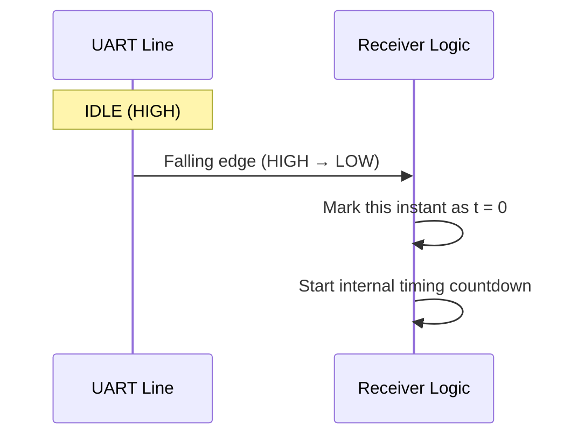

> **Critical insight:** The start bit is not just a "flag." It is a **timing synchronization event**. Every new byte re-synchronizes the receiver's timing from scratch — this is exactly what makes asynchronous communication reliable despite having no shared clock.

---

## Section 7 — The UART Frame

Now let's assemble the complete **UART frame** — the full sequence of events that happens on the wire to transmit one byte.

```text
| IDLE | START | D0 | D1 | D2 | D3 | D4 | D5 | D6 | D7 | PARITY (optional) | STOP | IDLE |
```

| Field | Purpose |
|---|---|
| **IDLE** | Line at rest, HIGH — nothing happening |
| **START** | LOW — signals "a new byte begins now" |
| **D0–D7** | The actual data bits (8-bit UART is most common; 5/6/7/9-bit configurations also exist) |
| **PARITY** | *(Optional)* An extra bit used for basic error detection |
| **STOP** | Signals the end of the frame; the line returns to idle (HIGH) |
| **IDLE** | Resting again, waiting for the next byte |

Every field exists to answer one of the timing/synchronization questions we raised earlier. Keep this table in mind — we'll expand each row in the sections ahead.

---

## Section 8 — Data Bits and LSB-First Transmission

The number of data bits in a UART frame is configurable — typically **5, 6, 7, 8, or 9** bits. The overwhelming majority of real-world UART usage is **8-bit** (one full byte per frame).

### LSB-First — a crucial and often-missed detail

Let's take a concrete byte: **0x52** (hexadecimal).

```text
Byte (decimal): 82
Byte (hex):     0x52
Byte (binary):  0  1  0  1  0  0  1  0
                D7 D6 D5 D4 D3 D2 D1 D0
```

Here's the question: in what order do these bits travel on the wire? When we *write* a number, we naturally write the Most Significant Bit (D7) first, on the left. But **UART commonly transmits the Least Significant Bit (D0) first**:

```text
Numeric representation (how we write/read the value):
D7  D6  D5  D4  D3  D2  D1  D0
 0   1   0   1   0   0   1   0

Wire transmission order (LSB-first):
D0 → D1 → D2 → D3 → D4 → D5 → D6 → D7
 0 →  1 →  0 →  0 →  1 →  0 →  1 →  0
```

**Why is this confusing at first?** Because we're trained to read numbers left-to-right, from most-significant to least-significant. But the *order bits travel on the wire* is a completely separate concept from *how we write the number down*. The underlying value (0x52) never changes — only the transmission order does.

> **How does the receiver know this?** The receiver is configured (in advance) to expect the first incoming bit to be D0. As bits arrive, the receiver places each one into the correct position and reconstructs the original byte once all bits have arrived.

---

## Section 9 — Baud Rate

**What is baud rate?** In simple terms — a number that describes how fast bits are transmitted. Common values: **9600 baud**, **115200 baud**.

For basic UART binary signaling, where each "symbol" on the wire represents exactly one bit, baud rate corresponds directly to **bits per second**.

### Calculating bit time

```text
bit_time = 1 / baud_rate
```

**At 9600 baud:**
```text
bit_time = 1 / 9600 ≈ 104.17 µs (microseconds) per bit
```

**At 115200 baud:**
```text
bit_time = 1 / 115200 ≈ 8.68 µs per bit
```

```text
Timeline at 9600 baud:
|◄──── 104.17 µs ────►|◄──── 104.17 µs ────►|◄──── 104.17 µs ────►|
         D0                    D1                    D2

Timeline at 115200 baud:
|◄─ 8.68 µs ─►|◄─ 8.68 µs ─►|◄─ 8.68 µs ─►|
      D0             D1             D2
```

**The key takeaway:** Higher baud rate → shorter bit duration → data moves faster, but the receiver's timing must be that much more precise.

**Real-world analogy — the conveyor belt:** Imagine a conveyor belt carrying boxes (bits) past an inspector (the receiver). The faster the belt moves, the less time the inspector has to look at each box before it's gone. A faster baud rate is exactly this: less time margin per bit, which makes accurate timing more critical.

---

## Section 10 — Sampling (One of the Most Important Concepts in This Document)

Let's start with the simplest possible definition:

> **Sampling means reading the value of a signal at one specific moment in time.**

The electrical signal on the wire exists continuously — there is *always* some voltage present. But the receiver does not need to treat every instant as a new decision point. Instead, it uses timing to check the signal at carefully chosen points.

```text
D0:
|─────────────────────|
          ↑
        SAMPLE (the value of D0 is read here)

D1:
                        |─────────────────────|
                                  ↑
                                SAMPLE (the value of D1 is read here)
```

One sample decision = the value of one bit. For an 8-bit frame, the receiver makes 8 separate sampling decisions, one per bit position.

### ⚠️ Correcting a very common misconception

❌ **Wrong idea:** "Don't sample between D0 and D1."

This phrasing is misleading, and it's often repeated without explanation.

✅ **Correct mental model:** Sampling happens **inside** each bit's time window — never at the boundary between two bits — and preferably as close to the **center** of that window as possible.

**Why is center sampling preferred?** Near the edges of a bit period, the signal may not have fully "settled," and small timing inaccuracies (from Section 14, clock mismatch) are more likely to cause the receiver to accidentally read the *wrong* bit. The center of the bit window is the point furthest from both edges — giving the most tolerance for small timing errors.

### A concrete numerical example

Assume bit_time = 100 µs.

```text
D0: 0–100 µs     → sample at approximately 50 µs  (the center)
D1: 100–200 µs   → sample at approximately 150 µs (the center)
D2: 200–300 µs   → sample at approximately 250 µs (the center)
```

```text
0µs        50µs      100µs      150µs      200µs      250µs      300µs
 |──────────●──────────|──────────●──────────|──────────●──────────|
        D0 center              D1 center              D2 center
```

> **Why the exact center?** Because the value of D0 is expected to remain stable across its *entire* 100 µs window. The center point is the safest possible moment — even with a small timing error, you're still reading well within the correct bit's territory, not drifting into the neighboring bit.

---

## Section 11 — How Does the Receiver Know *When* to Sample?

This is one of the most important sections in the entire document — it's where the start bit, baud rate, and sampling all come together into one working mechanism.

UART has no clock wire. So the receiver needs three ingredients:

1. **Configured baud rate** — agreed upon in advance by both sides
2. **Local clock** — the MCU's own internal oscillator
3. **Start bit edge** — the timing reference point (Section 6)

### The complete flow

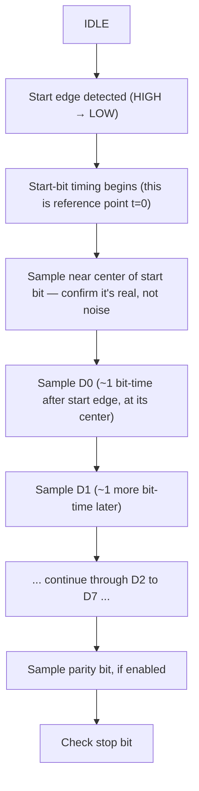

### Timing calculation

```text
bit_time = 1 / baud
```

The **first center sample** (of the start bit itself) typically occurs approximately **half a bit-time** after the detected start edge.

Each **subsequent data sample** typically occurs approximately **one full bit-time apart** from the previous one.

### Worked example at 9600 baud

`bit_time ≈ 104 µs`, so half a bit-time ≈ 52 µs.

```text
Start edge (t = 0)
   │
   │◄──── ~52 µs ────►│
                       ▼
                  Start-bit sample (confirm: is this a real start bit?)
                       │
                       │◄──── ~104 µs ────►│
                                           ▼
                                     D0 sample
                                           │
                                           │◄──── ~104 µs ────►│
                                                               ▼
                                                         D1 sample

...and so on through D7, then parity (if enabled), then the stop bit.
```

> **Important caveat:** This timing model is a conceptual approximation. The exact implementation detail (e.g., how many internal timing "ticks" occur per bit) depends entirely on the specific UART peripheral hardware — different MCU vendors implement this differently. We'll look at how oversampling refines this in the next section.

---

## Section 12 — What Does "Sampling" Physically Mean?

We've been using the phrase "sample the signal" — but what actually happens at the hardware level?

```text
RX pin (a wire carrying some voltage)
 ↓
Input circuitry (electronics that read the voltage)
 ↓
Logic interpretation (which logic level does this voltage correspond to?)
 ↓
0 or 1 (a digital value)
```

**Conceptually:**
- Voltage above a certain threshold → interpreted as logic **1** (HIGH)
- Voltage below a certain threshold → interpreted as logic **0** (LOW)

For an ESP32, this happens within a **3.3V logic** context. We deliberately avoid quoting exact threshold voltages here, because those precise numbers are chip-specific electrical characteristics that must be verified against the official datasheet — this section is about the *concept*, not exact numbers.

> **In plain terms:** Sampling means — at that one precise instant — checking what voltage is present on the RX pin, letting the input circuitry convert that voltage into a 0 or 1, and recording that value as the bit's result.

---

## Section 13 — Oversampling

UART receivers commonly run their internal timing clock **faster** than the baud rate itself. This is called **oversampling**.

Common values: **8x** or **16x** oversampling.

### Example

```text
1 bit = 100 µs (assumed)

16x oversampling:
100 / 16 = 6.25 µs   (internal timing tick interval)
```

**What this does and does NOT mean:**

❌ Oversampling does **not** mean "the receiver captures 16 separate final data bits."

✅ It means the receiver gets **multiple internal timing opportunities** within each single bit period, which are used for:

- **Start-bit detection** — more precisely confirming a real start edge versus a brief noise glitch.
- **Timing alignment** — more accurately locating the true center of each bit.
- **Noise filtering** — some implementations use multiple internal samples to filter out transient noise.
- **Center identification** — pinpointing the bit's midpoint with much finer resolution than "one tick per bit" would allow.
- **Majority-vote decisions** — some implementations take several internal samples near the center and decide the bit's value based on the majority.

### A simple majority-voting example

```text
5 internal samples taken near the bit's center: 1, 1, 1, 0, 1
Majority = 1  (four 1s vs. one 0)
→ Final decision: this bit = 1
```

> **Important caveat:** The exact UART sampling algorithm — how many internal ticks, whether majority voting is used, exactly which ticks are chosen — is entirely implementation-specific to that particular MCU's UART peripheral hardware. The example above illustrates the *concept*, not a universal standard.

---

## Section 14 — Clock Mismatch

As established, sender and receiver have **independent, separate clocks** (Section 2). In practice, no two independent clocks are ever perfectly identical — there is always some small tolerance/error between them.

### Example

```text
Sender's actual bit time:   100 µs
Receiver's actual bit time: 101 µs   (a small difference, due to clock accuracy tolerance)
```

This difference looks tiny, but it **accumulates** across the bits of a single byte:

```text
D0 expected sample point: 50 µs   → receiver's actual timing: 50.5 µs  (still fine)
D1 expected sample point: 150 µs  → receiver's actual timing: 151.5 µs (slight drift)
D7 expected sample point: 750 µs  → receiver's actual timing: 757.5 µs (drift has grown!)
```

If this drift grows large enough, the receiver eventually samples at the *wrong* moment — right near a bit boundary — and reads an incorrect bit value.

**How is this managed in practice?**

- **Center sampling** provides a built-in tolerance margin — because the center is the point furthest from both edges, small accumulated drift is less likely to cause a misread.
- **UART framing itself limits drift** — because every new byte starts with a fresh start bit, timing is **re-synchronized at the start of every single frame**. Drift never has the chance to accumulate across multiple bytes; it resets every time.
- This is exactly why **baud rate accuracy matters**. If the two clocks differ too much (e.g., more than a few percent), even a single byte can suffer sampling errors on its later bits.

**Real-world analogy:** Two people are timing each other using their own personal watches, and neither watch is perfectly accurate. If they're only measuring a short 8-second sequence, the small watch error barely matters. But if they let the same watch run indefinitely without resetting, the timing error keeps growing until it becomes a real problem. UART "resets the watch" at the start of every byte — which is exactly why the small clock mismatch rarely causes trouble in practice.

---

## Section 15 — The Stop Bit

At the end of a frame comes the **stop bit**.

```text
DATA → STOP → IDLE
```

**What the stop bit does:**
- Returns/holds the line in its **idle state** (typically HIGH).
- The receiver checks the line's state at the expected stop-bit position — if it isn't in the expected state, a **framing error** is raised (details in Section 19).

**Number of stop bits:** UART configuration commonly allows **1, 1.5, or 2** stop bits (conceptually). One stop bit is by far the most common. More stop bits give the receiver a bit more "recovery time" before the next frame begins, at the cost of slightly reduced effective data throughput.

---

## Section 16 — Parity

**Parity** is a simple **error-detection mechanism** — an extra bit used to help detect whether the data may have been corrupted during transmission.

Three possibilities:
- **No parity** — the parity mechanism is not used at all.
- **Even parity** — the total number of 1s across DATA + PARITY must be **even**.
- **Odd parity** — the total number of 1s across DATA + PARITY must be **odd**.

### Example 1

```text
Data: 1 0 1 1 0 0 1 0

Count of 1s: 4
```

**Even parity:** Total 1s must be even. 4 is already even, so parity bit = **0**.
```text
Total (data + parity) = 4 → EVEN ✓
```

**Odd parity:** Total 1s must be odd. 4 is even, so parity bit = **1** (4 + 1 = 5, odd).
```text
Total (data + parity) = 5 → ODD ✓
```

### Example 2

```text
Data: 1 0 1 1 0 0 0 0

Count of 1s: 3
```

**Even parity:** 3 is already odd, so parity bit = **1** (3 + 1 = 4, even).
```text
Total = 4 → EVEN ✓
```

**Odd parity:** 3 is already odd, so parity bit = **0** (it's already odd).
```text
Total = 3 → ODD ✓
```

### ⚠️ Correcting a very important misconception

❌ **Wrong idea:** "A parity bit value of 0 always means even parity."

✅ **Correct rule:** The parity bit's *value* (0 or 1) depends entirely on how many 1s are already present in the data — the rule is about the **total count of 1s**, not the parity bit's own value in isolation. Notice in the two examples above: parity bit came out as **0** in one case and **1** in another, purely because the data's 1-count was different.

**What does the receiver do?** The receiver independently counts the 1s in the received data bits, adds the received parity bit, and checks whether the total matches the agreed rule (even or odd). If the rule is violated, a **parity error** is flagged — signaling that a bit was probably corrupted somewhere in transit.

> **Limitation to remember:** Parity can only reliably detect a *single* bit error. If two bits flip simultaneously, the total count can accidentally still satisfy the parity rule — meaning parity is not a perfect or complete error-detection mechanism, only a basic first line of defense.

---

## Section 17 — 8N1, 8E1, 8O1

These are common shorthand labels for UART frame configuration:

```text
8N1:
  8 = data bits
  N = No parity
  1 = 1 stop bit

8E1:
  8 = data bits
  E = Even parity
  1 = 1 stop bit

8O1:
  8 = data bits
  O = Odd parity
  1 = 1 stop bit
```

### Frame diagrams

```text
8N1:
| IDLE | START | D0 D1 D2 D3 D4 D5 D6 D7 | STOP | IDLE |
        (no parity bit at all)

8E1:
| IDLE | START | D0 D1 D2 D3 D4 D5 D6 D7 | EVEN-PARITY | STOP | IDLE |

8O1:
| IDLE | START | D0 D1 D2 D3 D4 D5 D6 D7 | ODD-PARITY | STOP | IDLE |
```

`8N1` is by far the most commonly used default configuration in practice (e.g., in most ESP32 projects).

---

## Section 18 — How Does the Receiver Know Whether the Sender Is Using 8N1, 8E1, or 8O1?

This is a genuinely critical conceptual question — and many beginners assume the answer is "the wire tells it," which is wrong.

### The answer: **normally, it does NOT know automatically from the wire.**

UART configuration is a **pre-arranged agreement** — set in software on both sides *before* any communication begins.

**Example:**

```text
Sender configuration:      Receiver configuration:
115200                     115200
8 data bits                8 data bits
Even parity                 Even parity
1 stop bit                  1 stop bit
```

The sender **never transmits a message saying** "I am using 8E1." It simply sends bits, in a fixed order, at a fixed speed. The receiver must already know, in advance, how to interpret those bits.

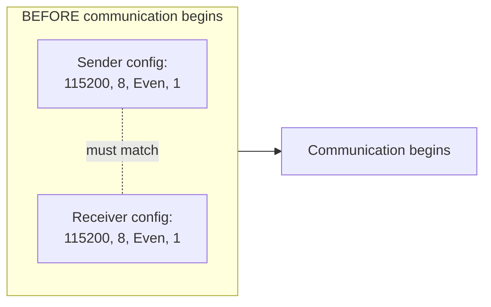

### What happens when configurations mismatch?

**8E1 ↔ 8O1 mismatch:** The receiver expects an odd-parity rule, but the sender is generating parity under an even-parity rule — the receiver will see continuous **parity errors**, because the rule never actually matches.

**8E1 ↔ 8N1 mismatch:** One side thinks there's a parity bit; the other doesn't. This causes complete **bit misalignment** — subsequent bits (and the stop bit position) get read at the wrong moments, corrupting every following byte too.

**9600 ↔ 115200 mismatch (baud rate mismatch):** This is the most severe case — the receiver samples at completely wrong timing points, and the result is essentially **garbage data**. In some unlucky cases, a byte can even *appear* superficially plausible while actually being fully corrupted — a particularly dangerous, misleading failure mode.

### Auto-baud — an exception worth knowing about

Some MCUs support an **auto-baud** feature — where the MCU can estimate the baud rate by observing the timing pattern of incoming signal edges. However:

- This is **implementation-specific** — not all MCUs support it, and those that do implement it differently.
- It typically only helps detect **baud timing** — it does not magically infer the entire frame format (data bits, parity, stop bits). Those still need to be configured separately.

---

## Section 19 — UART Errors

Let's walk through the common categories of UART errors. For each one: What happened? What does the hardware detect? What does software see? What should the driver do?

### 1. Parity Error

- **What happened?** The parity value the receiver calculates (from the received data) doesn't match the received parity bit.
- **What does hardware detect?** The UART peripheral itself performs the parity check (if enabled) and sets an error flag on mismatch.
- **What does software see?** A parity-error flag/status bit.
- **What should the driver do?** Treat that byte as unreliable — possibly discard it, request retransmission if the protocol supports it, and log the error count.

### 2. Framing Error

- **What happened?** At the expected stop-bit position, the line isn't in the expected state (typically HIGH).
- **What does hardware detect?** The UART peripheral checks the line's level at the stop-bit position; a mismatch sets a framing-error flag.
- **What does software see?** A framing-error flag/status bit.
- **What should the driver do?** This is often a sign of baud rate mismatch or electrical noise — log the error, and verify configuration (especially baud rate) matches on both sides.

### 3. Overrun Error

- **What happened?** New data arrived so quickly that older received data (still sitting in the RX register/FIFO) was overwritten before software could read it — data is lost.
- **What does hardware detect?** If the RX register/FIFO is full when a new byte completes, an overrun flag is set.
- **What does software see?** An overrun-error flag, and awareness that some data has gone missing.
- **What should the driver do?** Increase FIFO/buffer size, handle interrupts more promptly, or move to DMA-based reception (which moves many bytes automatically and reduces the risk of overrun).

### 4. Noise Error (if supported by the peripheral)

- **What happened?** During oversampling, the multiple internal samples taken don't agree with each other (indicating instability/glitching on the signal).
- **What does hardware detect?** Some UART peripherals compare oversampling results and can raise a noise flag (this is implementation-specific).
- **What does software see?** A noise-error flag, if supported.
- **What should the driver do?** Investigate wiring, grounding, and cable length — this typically points to an electrical/environmental issue rather than a configuration issue.

### 5. Break Condition (conceptual)

- **What happened?** The line stays LOW for longer than a normal data frame would ever require — an unusually long, sustained LOW condition.
- **What does hardware detect?** Some UART peripherals specifically distinguish this as a "break" condition.
- **What does software see?** A break-detect flag/event, if supported.
- **What should the driver do?** This is application-specific — sometimes it's used intentionally as a signal (e.g., "reset the line"), and sometimes it indicates a wiring/connection fault.

| Error type | Detected by | Typical cause |
|---|---|---|
| Parity error | UART hardware parity check | Single-bit corruption, or parity config mismatch |
| Framing error | Stop-bit level check | Baud rate mismatch, electrical noise |
| Overrun error | FIFO/register full check | Software too slow, no DMA, high baud rate |
| Noise error | Oversampling consistency check | Wiring/grounding/EMI issues |
| Break condition | Prolonged LOW detection | Intentional signal or wiring fault |

---

## Section 20 — FIFO

**Why does FIFO exist?** Data can sometimes arrive faster than the CPU can immediately process it.

**Without a FIFO:** The UART register can only hold **one byte** at a time. If the CPU doesn't read it before the next byte finishes arriving, the old byte is lost (this is the overrun error from Section 19).

**With a FIFO:** Multiple bytes can be temporarily buffered — giving the CPU more breathing room to get around to processing them.

```text
UART RX
 ↓
FIFO (can hold multiple bytes)
 ↓
CPU / DMA (reads at its own pace)
```

**Overflow/Overrun still possible:** If the FIFO itself fills up completely (because the CPU/DMA is reading even slower than that), overrun can still happen — the FIFO just delays the problem and gives more margin before it does.

**Real-world analogy:** A small inbox tray (the old, no-FIFO approach — holds only one item) versus a proper storage shelf (FIFO) — if parcels are arriving quickly and the tray isn't emptied fast enough, new parcels get dropped on the floor (data loss). A shelf can hold several parcels temporarily, giving the worker (the CPU) more time to come collect them.

---

## Section 21 — Interrupts

**How interrupt-driven UART reception works:**

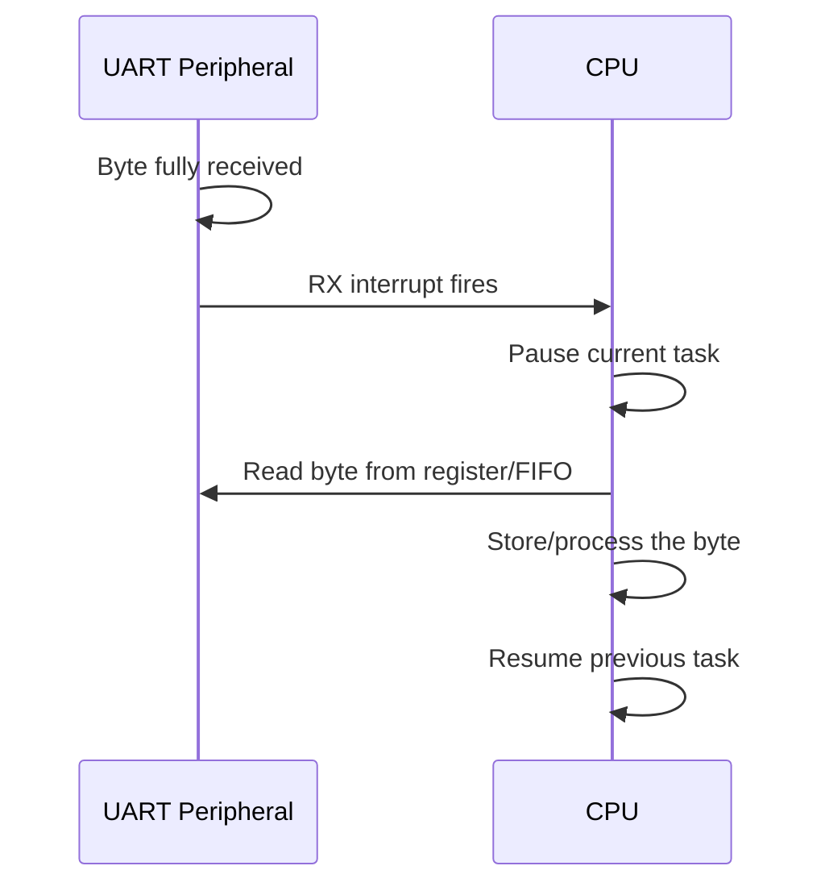

Common interrupt types:

| Interrupt | Fires when... |
|---|---|
| **RX interrupt** | A new byte has been received |
| **TX empty interrupt** | The TX register/FIFO is empty and ready for more data to send |
| **RX FIFO threshold interrupt** | A configured number of bytes has accumulated in the RX FIFO (useful for reading several bytes at once instead of one at a time) |
| **Transfer complete** *(conceptual)* | A full expected transaction has finished |

**The CPU overhead problem:** Getting a separate interrupt for every single byte means the CPU has to repeatedly pause and resume its work (a "context switch") for every byte. At high baud rates, with large volumes of data, this overhead can become significant — and this is precisely the problem DMA was designed to solve, which we explore next.

---

## Section 22 — DMA (Direct Memory Access) — From Absolute Zero

**DMA = Direct Memory Access**

**Simple definition:** A hardware mechanism that transfers data between a peripheral (like UART) and memory (RAM) **without the CPU having to manually copy every single byte itself.**

### The warehouse analogy

```text
UART       = the loading/unloading dock (where trucks/boxes arrive and depart)
DMA        = a warehouse worker (who physically moves boxes into storage)
RAM        = the warehouse (where boxes are stored)
CPU        = the manager (who gives instructions, but doesn't carry boxes himself)
```

### Without DMA — the normal flow

```text
UART → CPU → RAM
(the manager personally carries every single box into the warehouse — exhausting!)
```

### With DMA — the improved flow

```text
UART → DMA → RAM
(the worker carries the boxes; the manager just gives instructions once: "move these boxes, from here to there")
```

**Why does DMA exist?** Because the CPU's real value lies in making decisions and running application logic — not in mechanically copying bytes one at a time. DMA offloads this repetitive, mechanical data-movement task so it can happen independently, without needing the CPU's active attention for every byte.

---

## Section 23 — UART Without DMA

Let's use a concrete example — receiving **100 bytes**.

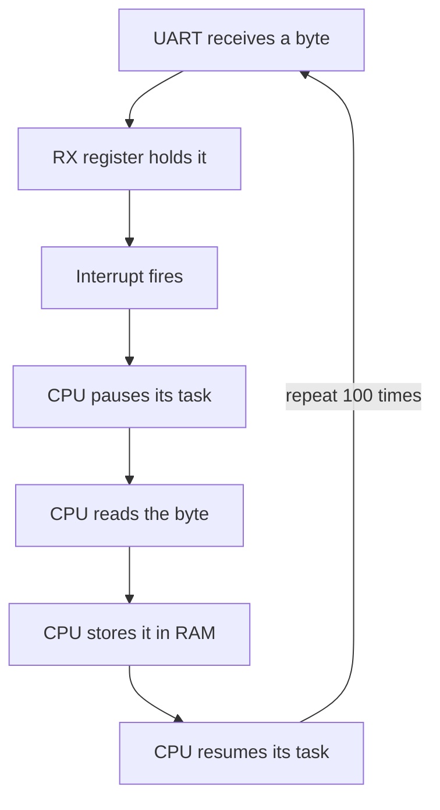

**CPU overhead:** for every one of the 100 bytes — interrupt handling, context save/restore, and the byte copy itself — all of this repeats 100 separate times. At higher baud rates (e.g., 115200 or beyond), this overhead can become a real bottleneck, leaving the CPU with less time available for actual application work.

---

## Section 24 — UART With DMA

First, DMA is configured:

```text
Source      = UART RX register
Destination = RAM buffer
Length      = 100 bytes
Direction   = peripheral → memory
```

### The flow

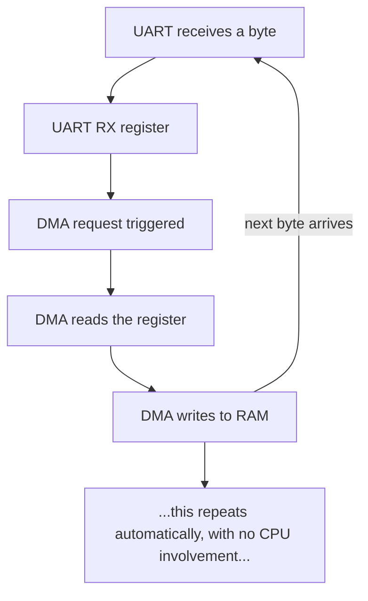

Meanwhile, the CPU is free to **do other work** — it doesn't need to pause and wait for every individual byte.

### At the end

```text
DMA transfer complete (all 100 bytes now in RAM)
 ↓
Interrupt/event fires (only once! — not once per byte)
 ↓
CPU now processes the entire buffer at once
```

**The key point:** The CPU **configures** DMA once, upfront — and **DMA performs the actual transfer**. The CPU does not manually copy each byte.

---

## Section 25 — The DMA Request

How does DMA know that UART has new data ready?

```text
UART receives a byte
 ↓
RX data-ready event (an internal hardware signal)
 ↓
DMA request (the peripheral signals the DMA controller: "I need attention")
 ↓
DMA transfer occurs
```

Key concepts:

| Term | Meaning |
|---|---|
| **DMA request** | A signal from the peripheral to the DMA controller saying "data is ready, please transfer it" |
| **DMA channel** | A resource/path within the DMA controller dedicated to one specific transfer; multiple channels allow multiple peripherals to use DMA simultaneously |
| **DMA controller** | The hardware block that actually manages and executes transfers |
| **DMAMUX** *(conceptually, where applicable)* | On some MCU architectures, a multiplexer that determines which peripheral is routed to which DMA channel |

> **Important caveat:** We deliberately avoid making specific claims here about ESP32's exact DMA architecture (which peripherals support DMA, how many channels exist, etc.), because different chips within the ESP32 family (ESP32, ESP32-S2, ESP32-S3, ESP32-C3, ESP32-C6) implement this differently. Always verify against the official documentation for the specific chip you're using.

---

## Section 26 — UART TX + DMA

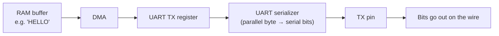

**Example — sending "HELLO":**

1. The CPU prepares "HELLO" (5 bytes: H, E, L, L, O) in RAM.
2. The CPU configures DMA **once**: "Take 5 bytes from this RAM location and feed them to the UART TX register."
3. DMA feeds each byte to the UART TX register on its own — the CPU doesn't need to issue instructions for each individual byte.
4. The UART hardware builds the actual serial frame for each byte — **START bit, DATA bits, PARITY (if configured), STOP bit.**

### ⚠️ Critical distinction

**DMA does not build the UART frame!** DMA only moves raw bytes from RAM into the UART's TX register. The **UART peripheral hardware itself** is what constructs the actual serial frame (timing, start bit, parity, stop bit).

In other words — DMA and the UART peripheral have clearly separated jobs: DMA handles *data movement*, UART handles *framing/serialization*.

---

## Section 27 — UART RX + DMA

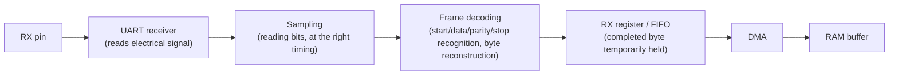

### ⚠️ Critical distinction

**DMA does not perform sampling!**

- **The UART peripheral** performs sampling, reads bits, and reconstructs the byte (exactly as covered in Sections 10–14).
- **DMA** only moves an **already-completed byte** (one that the UART has already placed into the RX register/FIFO) into RAM.

DMA never touches the electrical/timing layer at all — it operates purely at the data-movement layer, working only with bytes the UART has already fully assembled.

---

## Section 28 — ESP32 Practical Example

Let's look at how all of this appears in practice on an ESP32 — **conceptually.**

A typical ESP32 UART setup involves configuring:
- **TX GPIO** and **RX GPIO** (these are software-assignable on many ESP32 pins, because the chip has internal GPIO routing/matrix flexibility).
- Baud rate
- Data bits
- Parity
- Stop bits
- FIFO settings
- Interrupt configuration
- DMA (where supported by that specific ESP32 peripheral)

> **Important caveat:** The ESP32 family includes multiple variants (ESP32, ESP32-S2, ESP32-S3, ESP32-C3, ESP32-C6, etc.), and their exact UART/DMA architectures are **not identical**. What follows is a *conceptual* ESP32 UART description — treat it as distinct from "exact chip-specific implementation details." For precise specifics, always consult the official ESP-IDF documentation for your specific chip.

### Conceptual code example (ESP-IDF style)

```c
// Conceptual pseudocode — exact API names/parameters may vary across
// ESP-IDF versions and ESP32 variants. Always verify against the
// official documentation for the specific chip you're targeting.

uart_config_t uart_config = {
    .baud_rate = 115200,              // bit_time = 1/115200 ≈ 8.68 µs per bit
    .data_bits = UART_DATA_8_BITS,    // 8 data bits (D0–D7)
    .parity    = UART_PARITY_DISABLE, // No parity → this is the "N" in 8N1
    .stop_bits = UART_STOP_BITS_1,    // 1 stop bit
    // ... other fields (e.g. flow control) — implementation-specific
};
```

**What each field means (deep explanation):**

- `.baud_rate = 115200` — This is the foundation of the receiver's bit-timing calculation (Sections 9 and 11). Both sides must use the exact same value.
- `.data_bits = UART_DATA_8_BITS` — Determines how many data bits are in the frame (Section 8). This tells the receiver how many sampling decisions to make, and how to reassemble the byte.
- `.parity = UART_PARITY_DISABLE` — Whether parity is used, and if so, even or odd (Sections 16–17). Here it's disabled, so no parity bit will exist in the frame.
- `.stop_bits = UART_STOP_BITS_1` — How many stop bits end the frame (Section 15).

> **Reminder:** The struct name, field names, and enum values shown above are illustrative of a *typical* style — the actual ESP-IDF API structure, exact enum names, and available parameters can differ across versions and chip variants. Always check the official documentation before writing production code.

---

## Section 29 — ESP32 UART Hardware Flow

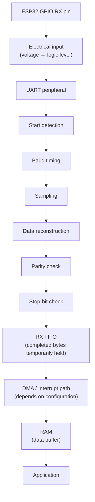

**The TX flow is the reverse:** Application → RAM buffer → DMA/direct write → UART TX register → serializer → framing (start/data/parity/stop built here) → TX pin → out onto the wire.

Each stage has a distinct responsibility:

| Stage | Responsibility |
|---|---|
| Electrical input | Just reads voltage, determines logic level |
| UART peripheral (sampling + decoding) | Timing-based bit reconstruction — the "core job" of UART |
| FIFO | Temporary buffering, giving CPU/DMA some breathing room |
| DMA / Interrupt | Data movement, or notifying the CPU |
| Application | Actual meaning/interpretation (business logic) |

---

## Section 30 — Complete End-to-End Example

Let's trace one complete example, from start to finish.

**Scenario:** An ESP32 receives byte **0xB2** from another MCU, using **115200 baud, 8E1** configuration.

### The full sequence

1. **Sender prepares 0xB2.**
2. **Convert to binary:** `0xB2` = `1 0 1 1 0 0 1 0` (D7...D0)
3. **Determine LSB-first transmission order:** wire order = D0, D1, D2, D3, D4, D5, D6, D7 = `0, 1, 0, 0, 1, 1, 0, 1`
4. **Count the 1s:** in `10110010`, the count = 4
5. **Determine parity (Even parity, because 8E1):** 4 is already even → parity bit = **0**
6. **Build the UART frame:** IDLE → START(LOW) → D0..D7 → PARITY(0) → STOP → IDLE
7. **Calculate bit duration:** at 115200 baud → bit_time ≈ 8.68 µs
8. **Start bit is transmitted** (line drops from HIGH to LOW)
9. **Receiver detects the falling edge** (Section 6)
10. **Receiver waits approximately half a bit-time (≈4.34 µs)**
11. **Receiver samples the start bit** (confirming it's real, not a glitch)
12. **Receiver samples D0 through D7**, each at its center (~8.68 µs apart)
13. **Receiver samples the parity bit**
14. **Receiver checks the stop-bit position** for the expected HIGH state
15. **The byte is reconstructed** (bits are placed back in the correct order → 0xB2)
16. **UART places this byte into the RX register/FIFO**
17. **DMA (if configured) moves the byte into RAM**
18. **CPU eventually processes the buffer** — the application now has 0xB2.

### Animated-style walkthrough

**Frame 1 — Idle:**
```text
TX MCU
  |
  |  IDLE = HIGH
  |
  +---------------------------------------> RX MCU
```

**Frame 2 — Start bit sent:**
```text
TX MCU
  |
  |  LINE DROPS: HIGH → LOW  (start bit)
  |
  +----┐
       └---------------------------------> RX MCU
                                            (falling edge detected — t=0 begins)
```

**Frame 3 — Data bits streaming (LSB-first: 0,1,0,0,1,1,0,1):**
```text
TX MCU:  sending D0=0, D1=1, D2=0, D3=0, D4=1, D5=1, D6=0, D7=1
RX MCU:  sampling each bit at its center, one bit-time apart
```

**Frame 4 — Parity + Stop:**
```text
TX MCU:  sending PARITY=0, then STOP=HIGH
RX MCU:  checks parity rule, confirms stop-bit level
```

**Frame 5 — Byte complete:**
```text
RX MCU:  byte reconstructed = 0xB2
         → placed in RX FIFO → moved by DMA → stored in RAM → processed by CPU
```

---

## Section 31 — Full Timing Diagram

```text
        IDLE      START    D0  D1  D2  D3  D4  D5  D6  D7  PARITY  STOP     IDLE
        HIGH      LOW
        ──────────┐
                   └──────┬───┬───┬───┬───┬───┬───┬───┬───┬───────┬─────────────►
                          │   │   │   │   │   │   │   │   │       │
                          ↓   ↓   ↓   ↓   ↓   ↓   ↓   ↓   ↓       ↓
                          S   S   S   S   S   S   S   S   S       S
                        (start (D0  (D1  (D2  (D3  (D4  (D5  (D6  (D7   (parity  (stop bit
                         bit    sample, same pattern for remaining bits)          sample)  level check)
                         sample)
```

> **Caveat:** This diagram is conceptual. The exact polarity (whether start bit is truly LOW in every case) and exact sampling timing depend on the specific UART peripheral's physical-layer configuration — this diagram illustrates typical UART behavior.

### Mermaid sequence diagram

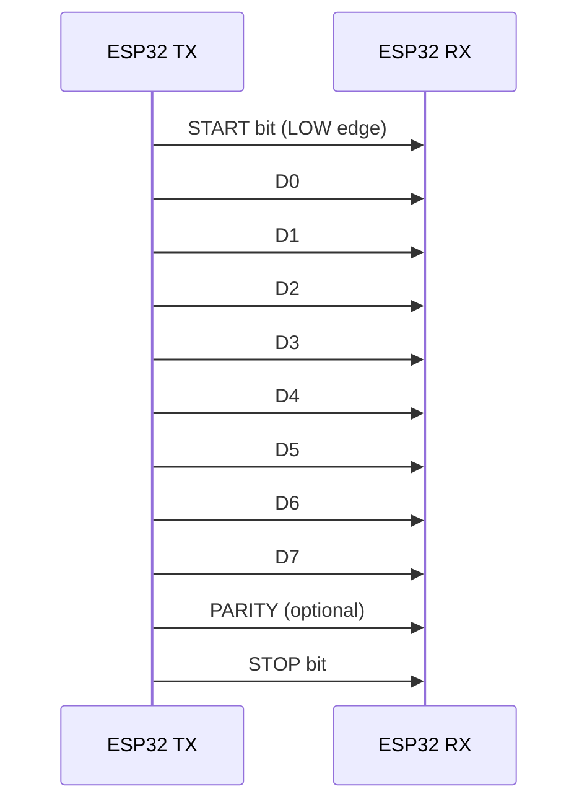

**Textual equivalent (in case Mermaid doesn't render):** TX first sends the START bit, then D0 through D7 in order, then (if enabled) the PARITY bit, and finally the STOP bit — all delivered to RX as one continuous sequence.

### UART frame as a state machine

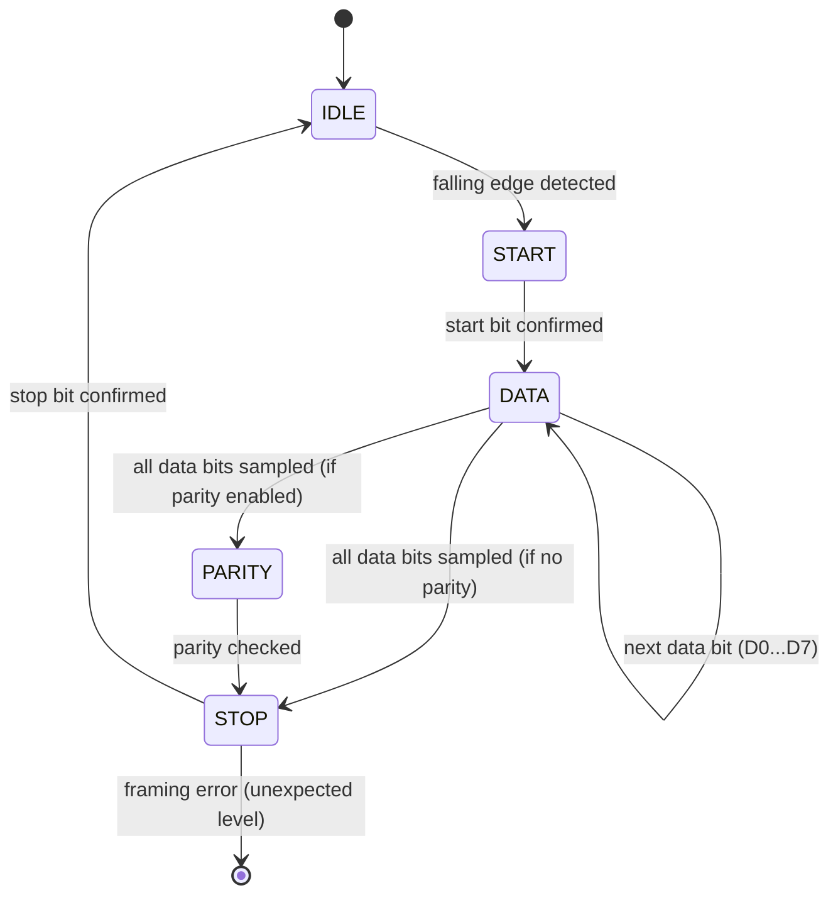

---

## Section 32 — CPU vs. UART vs. DMA Responsibilities

This is one of the most important tables in this entire document — internalize it.

| Component | Responsibility |
|---|---|
| **UART (peripheral hardware)** | Serial framing (building/recognizing start/stop), sampling, baud timing, parity calculation/checking, shift register (parallel↔serial conversion), FIFO management |
| **DMA** | Data movement (peripheral ↔ memory), transfer count tracking, address increment, generating completion events/interrupts |
| **CPU** | Configuring peripherals (upfront), running application logic, parsing received data, handling errors, responding to events |

> **The core mental model:** UART decides "what was sent/received" (timing-level). DMA decides "how it physically moves from A to B" (movement-level). CPU decides "what it means" (meaning-level). These are three distinct layers — and, as we'll see in Section 35, a well-designed driver keeps them cleanly separated.

---

## Section 33 — Things Beginners Commonly Get Wrong

| # | Misconception | Correction |
|---|---|---|
| 1 | UART = RS-232 | UART is a framing/protocol layer; RS-232 is a separate electrical standard. They can be used together, but they are not the same thing. |
| 2 | TX should connect to TX | TX must always connect to the *other side's* RX — otherwise nobody is "listening." |
| 3 | The receiver automatically knows whether it's 8N1/8E1/8O1 | UART configuration (baud, data bits, parity, stop bits) must be agreed upon in advance — it is never automatically announced on the wire. |
| 4 | Sampling means continuously reading the signal | Sampling means checking the signal's value at specific, chosen timing points — not continuously. |
| 5 | Sampling happens "between" bits | Sampling happens *inside* each bit's window, ideally near its center — never at the boundary between two bits. |
| 6 | A parity bit of 0 always means even parity | The parity rule applies to the *total count* of 1s (data + parity), not to the parity bit's own value in isolation. |
| 7 | DMA performs sampling | Sampling is entirely the UART peripheral's job. DMA only moves data that has already been fully assembled. |
| 8 | DMA is "another CPU" | DMA is a simple, pre-configured data-movement mechanism — it doesn't make decisions or run logic, it just moves data as instructed. |
| 9 | Baud rate always exactly equals bit rate, in every serial protocol | This is typically true for basic binary UART signaling, but it is not a universal rule for every serial protocol (some protocols encode more than one bit per "symbol"). |
| 10 | UART has a shared clock wire | UART is **asynchronous** — there is no clock wire; timing is managed via configuration agreement + start bit + independent local clocks. |
| 11 | The receiver samples only once for the entire byte | A separate sample is taken for *each* data bit — 8 (or 9, with parity) separate sampling decisions per byte. |
| 12 | 16x oversampling means 16 data bits | Oversampling means multiple internal timing checks per bit period — it does not change the number of final data bits at all. |
| 13 | FIFO and DMA are the same thing | FIFO is temporary storage (a "place"); DMA is a data-movement mechanism (a "process"). They solve different problems. |
| 14 | Interrupts and DMA are the same thing | An interrupt tells the CPU "pay attention now"; DMA moves data without needing the CPU's active involvement. Interrupts are still used *with* DMA (e.g., to signal transfer completion), but they are distinct concepts. |

---

## Section 34 — Real-Life Debugging Scenarios

Let's walk through some practical troubleshooting scenarios — these will genuinely come up in real projects.

### Scenario 1: Sender at 115200 8N1, Receiver at 9600 8N1

**What happens?** The receiver's timing calculations are based on the wrong baud rate — it samples at completely wrong moments. Result: essentially **garbage data**, or repeated framing errors.

**Why?** The receiver's assumed bit_time (1/9600 ≈ 104 µs) is wildly different from the sender's actual bit_time (1/115200 ≈ 8.68 µs) — the receiver ends up sampling multiple times within what the sender considers a single bit, at completely arbitrary positions.

### Scenario 2: Sender at 115200 8E1, Receiver at 115200 8O1

**What happens?** Baud rate and data bits match, but the parity rule doesn't — the receiver will see continuous **parity errors**.

**Why?** The sender generates its parity bit according to an even-parity rule; the receiver checks it against an odd-parity rule. These rules will almost always disagree (except by pure coincidence on specific data patterns).

### Scenario 3: TX Connected to TX

**What happens?** Both sides are only "talking" — nobody is "listening." No communication happens at all. In some cases, two output drivers actively fighting on the same wire can also create electrical stress that may be harmful to the hardware.

**Why?** TX is an **output** pin, RX is an **input** pin. Connecting two outputs together means neither side ever captures any data, and the two signals can actively conflict electrically.

### Scenario 4: Wrong Voltage Level / RS-232 Wired Directly to an MCU UART

**What happens?** RS-232 voltage levels are significantly different from — and typically far higher/wider-swinging than — an MCU's 3.3V logic levels. This can **damage the MCU's GPIO pin**, sometimes permanently.

**Why is it dangerous?** MCU GPIO pins are electrically rated for a specific voltage range. Exceeding that range can damage the internal circuitry. This is exactly why a level-shifting transceiver (e.g., a MAX3232-type IC) is required (Section 4).

### Scenario 5: The CPU Is Missing Incoming Bytes

**Possible causes:**
- **FIFO fills up too quickly** — software isn't reading in time.
- **Interrupt latency is too high** — some other higher-priority task is delaying interrupt handling.
- **Manual byte-by-byte reading without DMA** — this simply doesn't scale at high baud rates.

**Solutions:** Increase FIFO threshold size, tune interrupt priorities, or move to DMA-based reception (which significantly reduces CPU load).

### Scenario 6: Randomly Corrupted Bytes

**Possible causes (there are several — investigate systematically):**
- Baud rate mismatch
- Clock accuracy error (Section 14)
- Electrical noise (especially over longer cables)
- Grounding issues (GND not properly connected)
- Wrong frame configuration (data bits/parity/stop bits mismatch)
- Wrong electrical voltage level (voltage-domain mismatch)
- Buffer overflow (FIFO/RAM buffer filled up)
- Software parsing bug (byte alignment errors)

> **Debugging approach:** Always start with the simplest checks first — does the baud rate match, is GND properly connected, are TX/RX properly crossed — then move on to more subtle electrical/timing issues.

---

## Section 35 — Driver-Level Thinking: How a Senior Engineer Approaches UART

A senior embedded engineer mentally separates UART into distinct **layers**:

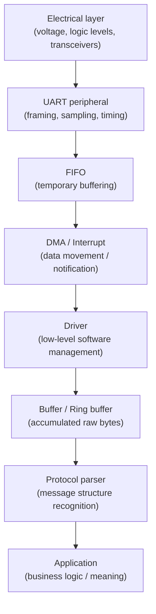

**Why should these layers stay separate?**

Consider this: the UART driver **does not need to know** that "this byte represents a temperature value." The driver's job is only to reliably move and buffer bytes.

- **UART driver** — moves bytes (and handles raw hardware errors).
- **Protocol parser** — recognizes "message structure" within those bytes (e.g., "these 5 bytes form one complete packet").
- **Application** — determines the actual "meaning" of that message (e.g., "this is a temperature reading of 25°C").

If these layers get mixed together (e.g., temperature-parsing logic embedded directly inside the UART driver), the code stops being reusable, and a change in one layer can unexpectedly break another.

---

## Section 36 — Ring Buffer (Circular Buffer)

**Why is a ring buffer useful?** UART data can arrive at any time (asynchronously), but the application can't always process it at exactly the same rate. A ring buffer is a data structure that reuses old memory space in a **circular** pattern, so you don't need to keep allocating new memory constantly.

```text
UART + DMA/Interrupt
     ↓
Ring buffer (fixed-size, circular)
     ↓
Parser (reads gradually, frees up space as it goes)
```

**Head and Tail pointers:**
- **Head (write pointer)** — indicates where new data should be written next (UART/DMA writes here).
- **Tail (read pointer)** — indicates where the next data should be read from (the parser reads from here).

When the head pointer reaches the end of the buffer, it "wraps around" back to the beginning (just like a circle) — hence the name "ring" buffer.

**Real-world analogy:** Picture a warehouse with a circular storage rack. New parcels are placed on one side (head), and older parcels are picked up from the other side (tail). Because the rack is circular, once space is freed up, it can be reused again from the beginning — no need to keep building new shelves.

---

## Section 37 — UART Protocol vs. Application Protocol

This distinction is essential to understand.

**What UART provides:**
- Bytes (raw data)
- Framing (timing-level structure via start/stop/parity)
- Timing (governed by baud rate)
- Optional parity (basic error detection)

**What UART does NOT provide automatically:**
- Packet length (how many bytes make up one "message")
- Message type (what kind of message this is)
- Checksum/CRC (higher-level data-integrity verification)
- Command ID (what action should be taken)
- Meaning of the payload (what the actual data represents)

All of this is defined by an **application-level protocol** — built *on top of* UART.

### Example application packet structure

```text
| START | LENGTH | COMMAND | PAYLOAD | CRC |
```

This entire structure lives *above* UART — UART is only responsible for reliably delivering these bytes; it has no awareness of what they mean.

---

## Section 38 — ESP32 Real-World Scenario

Let's walk through a practical scenario — **ESP32 ↔ sensor/controller** communication.

**Suppose a sensor sends this packet:**

```text
AA 05 01 10 20 30 CRC
```

**Breakdown:**
- `AA` — START marker (signals the beginning of a packet)
- `05` — LENGTH (how many payload bytes follow)
- `01` — COMMAND (what kind of data this is — e.g., "temperature reading")
- `10 20 30` — PAYLOAD (the actual data bytes)
- `CRC` — checksum (used to verify data integrity)

**What UART handles:** Just raw byte transport — reliably receiving `AA, 05, 01, 10, 20, 30, CRC` in the correct order, with correct timing.

**What the application protocol handles:**
- Recognizing `AA` as the start of a packet.
- Reading `05` to know how many more bytes to expect.
- Determining the command type from `01`.
- Extracting the payload.
- Calculating a CRC and comparing it against the received CRC (to detect data corruption).

**How DMA + Ring Buffer help here:** DMA (if used) continuously streams incoming bytes into a ring buffer in RAM — the CPU doesn't need to pause for every individual byte. The parser then reads gradually from that ring buffer, looking for `AA`, and once a complete packet has accumulated, it processes it.

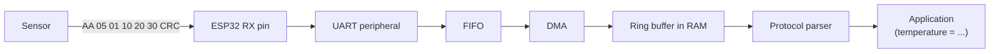

---

## Section 39 — Deep Engineer Insights (What Beginners Rarely Learn)

- **UART is fundamentally a timed state machine.** Every frame walks through IDLE → START → DATA → (PARITY) → STOP → IDLE, and each state's duration is predetermined by the baud rate.

- **The start bit is the foundation of frame synchronization.** It doesn't just mean "beginning" — it establishes a "zero reference point" for the receiver's entire internal timing sequence.

- **The receiver's local clock is always an approximation.** No clock is perfectly accurate; UART's design (center sampling + per-frame re-synchronization) exists specifically to tolerate this imperfection.

- **Sampling is a timing decision, not merely "reading a pin."** Deciding *when* to read is the real engineering challenge — deciding *what* was read (0 or 1) is comparatively trivial.

- **UART trades a shared clock wire for a pre-agreed timing contract.** This is a deliberate trade-off: fewer wires, at the cost of requiring both sides' configuration to match precisely.

- **Framing creates a bounded synchronization window.** Because each byte is independent, timing drift never accumulates beyond a single byte — the next byte's start bit resets everything.

- **Parity detects some errors, but cannot correct them.** It only tells you "something is likely wrong," never "what the correct value should have been."

- **DMA doesn't make UART faster — it reduces CPU involvement in data movement.** The actual transmission speed is still governed entirely by the baud rate.

- **FIFO absorbs bursts** — meaning even short bursts of fast-arriving data can be temporarily tolerated without loss.

- **DMA and FIFO solve different problems.** FIFO provides "temporary time margin" (buffering); DMA provides "reduced CPU involvement" (offloading).

- **Driver architecture should separate transport from protocol parsing.** This keeps code reusable, testable, and maintainable.

- **Higher baud rate means tighter timing constraints.** Shorter bit time makes clock accuracy and signal quality far more critical.

- **Electrical signaling and UART framing are separate layers.** One determines "what voltage is present," the other determines "what those voltage transitions mean."

---

## Section 40 — Visual Master Map

```text
REMOTE DEVICE
   │
   │ TX
   ▼
ESP32 RX PIN
   │
   ▼
Electrical input
   │
   ▼
UART peripheral
   │
   ├── Start detection
   ├── Baud timing
   ├── Sampling
   ├── Data reconstruction
   ├── Parity check
   ├── Stop-bit check
   │
   ▼
RX FIFO
   │
   ├────────────── Interrupt ──────► CPU
   │
   └────────────── DMA ────────────► RAM
                                      │
                                      ▼
                                   Driver
                                      │
                                      ▼
                                Ring Buffer
                                      │
                                      ▼
                                 Protocol
                                  Parser
                                      │
                                      ▼
                                Application
```

**TX — the reverse flow:**

```text
Application
   │
   ▼
Protocol Parser (builds the message — length, command, payload, CRC)
   │
   ▼
Driver
   │
   ▼
RAM buffer
   │
   ├────────────── DMA ────────────► UART TX register
   │                                      │
   └── (or direct CPU write, without DMA, is also possible)
                                          ▼
                                   UART serializer (builds framing:
                                   START, DATA, PARITY, STOP)
                                          │
                                          ▼
                                    ESP32 TX PIN
                                          │
                                          │ TX
                                          ▼
                                    REMOTE DEVICE
```

### Full-system Mermaid view

```mermaid
flowchart TD
    subgraph RX_PATH["RX PATH"]
    R1[Remote Device TX] --> R2[ESP32 RX pin]
    R2 --> R3[Electrical input]
    R3 --> R4[UART peripheral: start/sample/decode/parity/stop]
    R4 --> R5[RX FIFO]
    R5 --> R6[DMA]
    R6 --> R7[RAM]
    R7 --> R8[Driver]
    R8 --> R9[Ring Buffer]
    R9 --> R10[Protocol Parser]
    R10 --> R11[Application]
    end

    subgraph TX_PATH["TX PATH"]
    T1[Application] --> T2[Protocol Parser builds message]
    T2 --> T3[Driver]
    T3 --> T4[RAM buffer]
    T4 --> T5[DMA]
    T5 --> T6[UART TX register]
    T6 --> T7[UART serializer builds frame]
    T7 --> T8[ESP32 TX pin]
    T8 --> T9[Remote Device RX]
    end
```

---

## Section 41 — One-Page Cheat Sheet

```text
UART = Universal Asynchronous Receiver/Transmitter

Frame:
  START + DATA + optional PARITY + STOP

Common configurations:
  8N1  = 8 data bits, No parity, 1 stop bit
  8E1  = 8 data bits, Even parity, 1 stop bit
  8O1  = 8 data bits, Odd parity, 1 stop bit

Bit time:
  bit_time = 1 / baud_rate

Sampling:
  Reading the signal's value at a chosen timing point (not continuous reading)

Center sampling:
  Sampling near the middle of each bit is preferred (furthest from edges, most tolerant of timing error)

Parity:
  Even → total 1s (data + parity) = even
  Odd  → total 1s (data + parity) = odd

DMA:
  Peripheral ↔ RAM data transfer, without the CPU manually copying every byte

TX flow:
  RAM → DMA (optional) → UART TX register → serializer (framing) → TX pin

RX flow:
  RX pin → UART peripheral (sampling + decoding) → FIFO → DMA (optional) → RAM

Remember:
  - UART builds the frame; DMA does not perform sampling.
  - Configuration (baud, data bits, parity, stop bits) must be agreed upon in advance.
  - TX always connects to the other side's RX.
  - UART ≠ RS-232 (different electrical standards).
```

---

## Section 42 — Final Mental Model

Let's finish with a simple story — the kind you might tell a curious 12-year-old — and then translate every part of it back into precise engineering terms.

> Imagine two warehouses — one that sends (the sender), and one that receives (the receiver). Between them is a single road (the wire), and boxes (bits) travel down it one after another. Each warehouse has its own clock, and they've already agreed in advance: "we'll send/receive one box every so often" (the baud rate agreement).
>
> When the sender is ready to send a new set of boxes (a new byte), it gives a special signal — the light on the road changes in a specific way (the start bit) — telling the receiver, "pay attention now, new boxes are coming!" The receiver starts its own stopwatch from that exact moment.
>
> Then, one by one, the boxes (bits) arrive, and the receiver looks carefully at the *middle* of each box's time slot to decide: "is this a 1 or a 0?" All these boxes together form one complete set (a byte). Sometimes, one extra box (the parity bit) is sent along — it says, "check that the count is right." Finally, a "set complete" signal (the stop bit) arrives.
>
> This completed byte is now placed near the warehouse door (the UART FIFO). Then a helpful worker (DMA) comes and carries it directly into the main storage warehouse (RAM) — the manager (CPU) doesn't have to carry each box personally. Eventually, the manager comes and looks at all the boxes, and figures out what they actually mean — "ah, this is sensor data about temperature!"

Now, let's translate this same story back into engineering terms:

1. Both devices agree on UART settings (baud, data bits, parity, stop bits).
2. The sender begins a frame.
3. The start bit tells the receiver to synchronize.
4. The receiver uses its local clock and the configured baud rate.
5. The receiver samples each bit at the proper timing point.
6. The bits together form a byte.
7. Optional parity is checked.
8. The stop bit confirms the frame boundary.
9. UART places the received byte into the FIFO/register.
10. DMA (if available) moves the byte into RAM.
11. The CPU eventually processes the data.
12. A higher-level protocol gives meaning to the raw bytes.

---

> **Final thought:** UART is, in essence, an elegant solution to a genuinely hard problem — achieving reliable communication *without* a shared clock wire, using nothing more than prior agreement, timing reconstruction, and per-frame re-synchronization. Once this fundamental principle truly clicks, every other piece of UART — from the start bit all the way to DMA — starts to feel logical and inevitable, rather than arbitrary.

**Having worked through this entire document, you now understand:**

Why UART exists, what asynchronous really means, TX/RX, electrical levels, the idle state, the start bit, data bits, LSB-first transmission, baud rate, bit time, sampling, center sampling, receiver timing, oversampling, clock mismatch, parity, 8N1/8E1/8O1, configuration agreement, the stop bit, framing and parity errors, FIFO, interrupts, DMA, UART RX+DMA, UART TX+DMA, ESP32 UART architecture (conceptually), driver architecture, ring buffers, application protocols, and real-world debugging.

**You can now think about UART the way a senior embedded engineer does.**